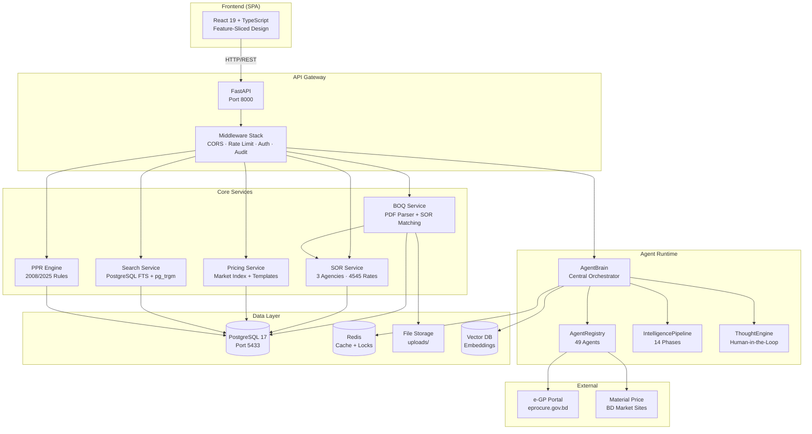

# ARCH-001: System Architecture Overview

## Components

| Layer | Components | Responsibility |
|-------|-----------|---------------|
| Frontend | React 19 SPA | UI rendering, state management, API calls |
| API Gateway | FastAPI + Middleware | Request routing, auth, rate limiting, audit |
| Core Services | BOQ, SOR, Pricing, Search, PPR | Domain logic |
| Agent Runtime | Brain, Registry, Pipeline, Thought | AI orchestration |
| Data Layer | PostgreSQL, Redis, FS, VectorDB | Persistence |
| External | e-GP, Material Sites | Data sources |
