# ARCH-003: Agent Architecture

```mermaid
graph TB
    subgraph "Agent Brain"
        BRAIN[AgentBrain<br/>Message Router + Knowledge Store]
        REG[AgentRegistry<br/>49 Registered Agents]
        PIPE[IntelligencePipeline<br/>Phase Orchestration]
    end

    subgraph "Discovery (3)"
        A001[agent-001<br/>TenderRadar]
        A002[agent-002<br/>TenderAcquisition]
        A003[agent-003<br/>CorrigendumWatchdog]
    end

    subgraph "Intelligence (6)"
        A005[agent-005<br/>BOQIntelligence]
        A006[agent-006<br/>SpecIntelligence]
        A014[agent-014<br/>AwardIntelligence]
        A019[agent-019<br/>ResourceCapacity]
        A042[agent-042<br/>APPForecast]
        A047[agent-047<br/>ChangeDetection]
    end

    subgraph "Evaluation (7)"
        A007[agent-007<br/>EligibilityCompliance]
        A008[agent-008<br/>RiskIntelligence]
        A009[agent-009<br/>PPREvaluation]
        A010[agent-010<br/>PPR2025Compliance]
        A010B[agent-010b<br/>LERTPrediction]
        A037[agent-037<br/>PPR2025Dashboard]
        A046[agent-046<br/>DataQualityValidator]
    end

    subgraph "Pricing (6)"
        A011[agent-011<br/>RateAnalysis]
        A012[agent-012<br/>MarketRateIntelligence]
        A044[agent-044<br/>SORZoneMatcher]
        A020[agent-020<br/>EGPRateFill]
        A033[agent-033<br/>VatTax]
        A030[agent-030<br/>RABillPredictor]
    end

    subgraph "Competitor (6)"
        A013[agent-013<br/>CompetitorIntelligence]
        A015[agent-015<br/>CompetitorPricingPredictor]
        A016[agent-016<br/>WinProbability]
        A017[agent-017<br/>BidPositionOptimizer]
        A028[agent-028<br/>SyndicateRadar]
        A036[agent-036<br/>MOATSLTAnalyzer]
    end

    subgraph "Decision (5)"
        A018[agent-018<br/>AIBidAssistant]
        A021[agent-021<br/>FinancialIntelligence]
        A022[agent-022<br/>ExecutiveDecision]
        A039[agent-039<br/>BidNoBid]
        A043[agent-043<br/>ClientIntelligence]
    end

    subgraph "Acquisition (7)"
        A031[agent-031<br/>TenderPreparation]
        A034[agent-034<br/>TenderDocumentAgent]
        A032[agent-032<br/>DocumentPreparation]
        A004[agent-004<br/>DocumentAI]
        A035[agent-035<br/>TenderDashboard]
        A024[agent-024<br/>SubmissionValidation]
        A045[agent-045<br/>OpeningReportAgent]
    end

    subgraph "Knowledge (4)"
        A025[agent-025<br/>KnowledgeLake]
        A023[agent-023<br/>ReportGeneration]
        A040[agent-040<br/>CompanyBrain]
        A041[agent-041<br/>MarketBrain]
    end

    subgraph "Learning (1)"
        A026[agent-026<br/>LearningAgent]
    end

    BRAIN --> REG
    BRAIN --> PIPE
    PIPE --> A001
    PIPE --> A002
    PIPE --> A005
    PIPE --> A007
    PIPE --> A011
    PIPE --> A013
    PIPE --> A016
    PIPE --> A022
    PIPE --> A025
```



## Agent Dependency Graph

```
001 (Radar) → 002 (Acquisition) → 005 (BOQ) → 007 (Eligibility) → 016 (WinProb) → 039 (BidNoBid) → 022 (Executive)
```

## Communication

| Pattern | Mechanism |
|---------|-----------|
| Agent → Agent | `brain.ask_agent(target_id, message)` |
| Agent → Knowledge | `brain.store_knowledge(type, data)` |
| Brain → All | `brain.broadcast(event)` |
| Pipeline | Sequential with `upstream` context dict |
