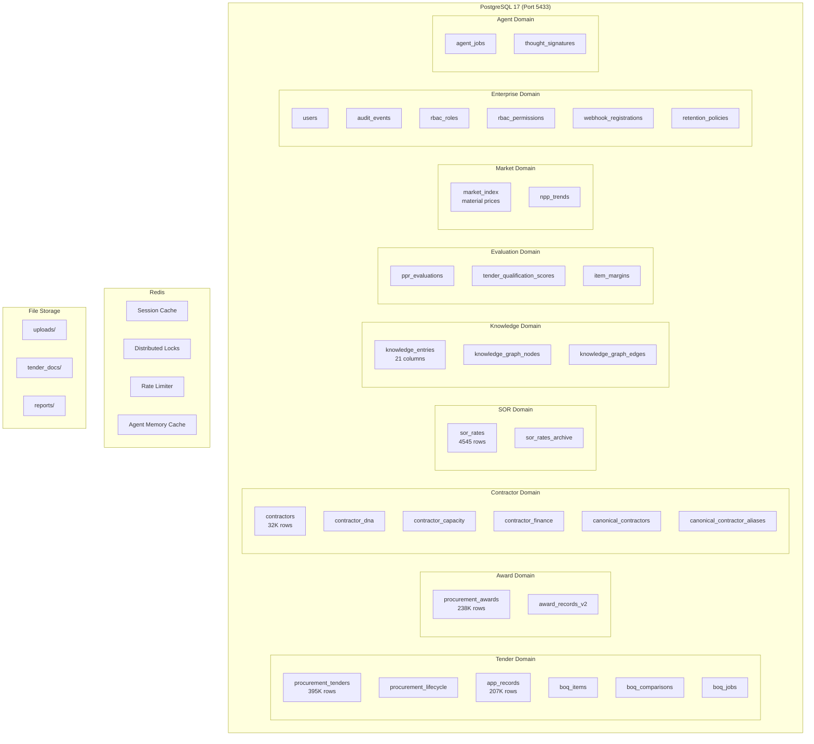

# ARCH-004: Database Architecture



## Table Sizes

| Table | Rows | Indexes |
|-------|------|---------|
| procurement_tenders | 395K | tender_id (PK), agency_code, closing_date |
| procurement_awards | 238K | contractor, agency, year |
| app_records | 207K | tender_id, package_no |
| contractors | 32K | canonical_id, name |
| sor_rates | 4,545 | agency+code (composite), description (GIN) |
| knowledge_entries | Variable | entry_type+tender_id, agent_id, tsvector |

## Key Relationships

```
procurement_tenders.tender_id → procurement_lifecycle.tender_id
procurement_tenders.tender_id → boq_items.tender_id
procurement_awards.tender_id → procurement_tenders.tender_id
contractors.canonical_id → contractor_dna.contractor_id
contractors.canonical_id → award_records_v2.contractor
sor_rates.code → boq_items.sor_code
```
