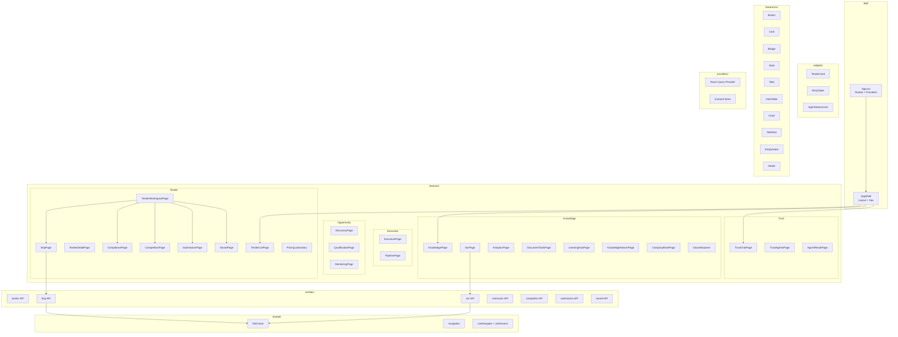

# ARCH-005: Frontend Component Architecture

## Feature-Sliced Design Layers

| Layer | Purpose | Examples |
|-------|---------|---------|
| `app/` | Entry point, providers, routing | App.tsx, QueryClient setup |
| `features/` | User-facing pages | TenderListPage, SorPage |
| `entities/` | Domain data (types + API) | boq/, sor/, competitor/ |
| `widgets/` | Composed UI blocks | TenderCard, BOQTable |
| `shared/` | Reusable UI primitives | Button, Card, Badge |
| `layouts/` | Page layouts | ScreenTemplate, AppShell |
| `providers/` | Context providers | React Query, Zustand |
| `hooks/` | Data hooks | useTenderList, useSorSearch |
