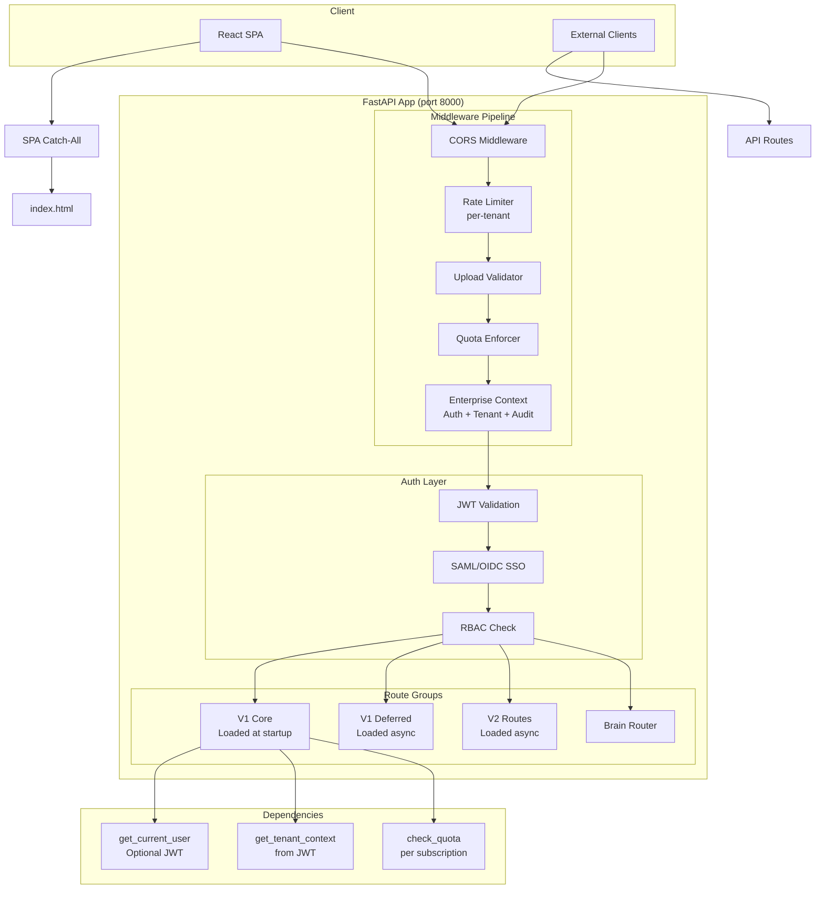

# ARCH-006: API Gateway & Routing



## Route Loading Strategy

| Group | Load Timing | Routers |
|-------|------------|---------|
| V1 Core | At startup (synchronous) | auth, boq, sor, competitors, pricing, contractors, search, validation, reports |
| V1 Deferred | Background thread | tenders, awards, dashboard, intelligence, predictions, executive, ppr2025, agents, and 20+ more |
| V2 | Background thread | enterprise, sso, analytics, benchmarking, predictions, market_trends, documents, team |
| Brain | At startup | brain_router (orchestration, knowledge, pipeline) |

## Rate Limiting

| Tier | Limit | Window |
|------|-------|--------|
| Free | 60 req/min | Sliding window |
| Pro | 300 req/min | Sliding window |
| Enterprise | Custom | Configurable |

## Error Response Format

```json
{
  "error": "quota_exceeded",
  "message": "Monthly quota exceeded",
  "details": { "used": 1000, "limit": 1000 },
  "retry_after": 2592000
}
```
