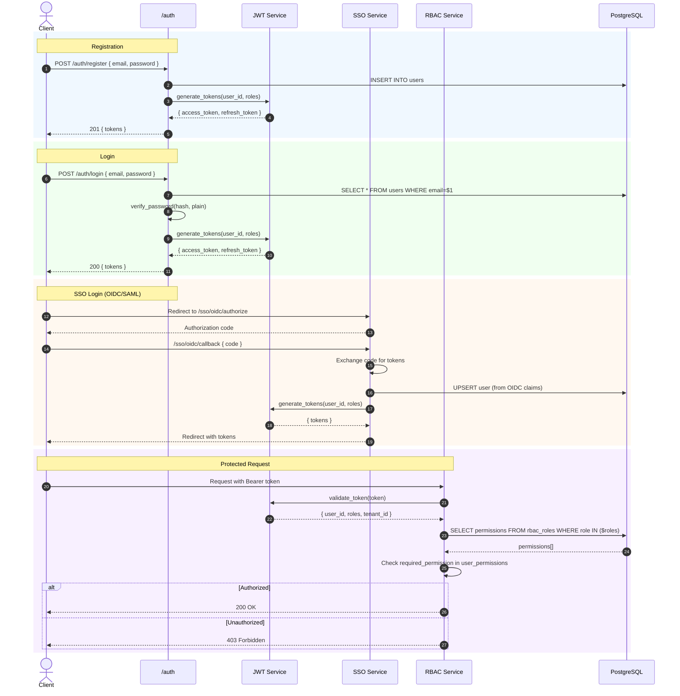

# ARCH-007: Authentication & Authorization



## Roles

| Role | Permissions |
|------|------------|
| `admin` | Full access |
| `manager` | Read + Write + Execute agents |
| `analyst` | Read + Analyze |
| `viewer` | Read only |

## JWT Claims

```json
{
  "sub": "user_id",
  "tenant_id": "tenant_id",
  "roles": ["manager"],
  "permissions": ["boq:read", "boq:write", "agents:execute"],
  "exp": 1234567890
}
```

## Token Refresh Flow

1. Client detects 401 response
2. POST `/auth/refresh` with refresh_token
3. Validate refresh_token against DB (not revoked, not expired)
4. Generate new access_token (15min TTL)
5. Old refresh_token revoked, new one issued
