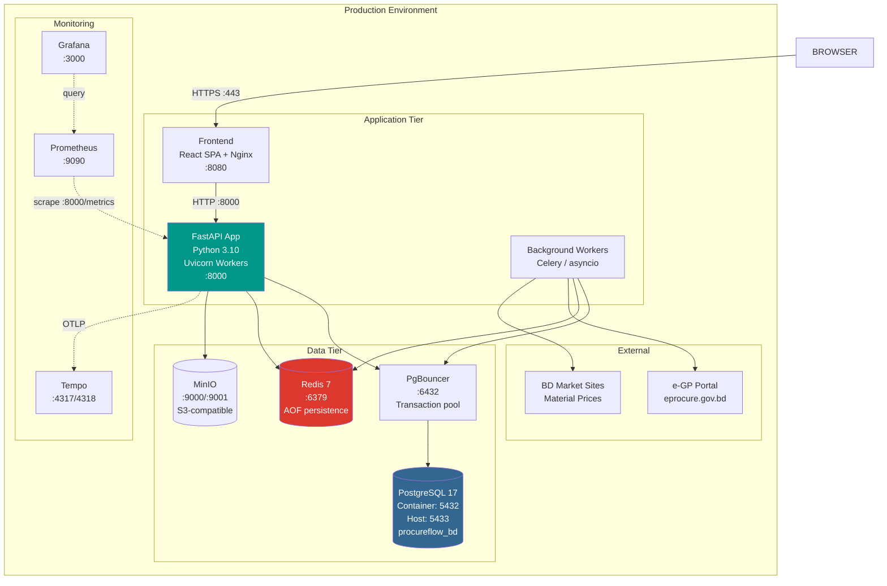

# ARCH-008: Deployment Architecture



## Deployment Stack

| Component | Technology | Container Port | Host Port | Notes |
|-----------|-----------|---------------|-----------|-------|
| Runtime | Python 3.10 | — | 8000 | Uvicorn ASGI server |
| Web Server | Uvicorn | 8000 | 8000 | `--host 0.0.0.0 --port 8000` |
| Database | PostgreSQL 17 | **5432** | **5433** | Host port 5433 avoids collision with local PG |
| Cache | Redis 7 | 6379 | 6379 | AOF persistence enabled |
| Storage | MinIO | 9000 | 9000 | S3-compatible object storage |
| Frontend | React SPA (Nginx) | 80 | 8080 | Static build served by Nginx |
| Pooler | PgBouncer | 6432 | 6432 | Transaction-mode connection pooling |
| Monitoring | Prometheus | 9090 | 9090 | Metrics scraping |
| Dashboard | Grafana | 3000 | 3000 | Dashboards + alerting |
| Tracing | Tempo | 4317/4318 | 4317/4318 | OTLP gRPC + HTTP |

### Port Mapping Explainer

PostgreSQL inside the Docker container listens on the default port **5432**. All container-internal services connect via `postgres:5432`. The host-side port is mapped to **5433** to avoid collision with any PostgreSQL instance running on the developer's machine. The `DATABASE_URL` uses `:5432` when connecting container-to-container, and `:5433` only when connecting from the host (local dev, `psql`, pgAdmin).

## Startup Sequence

1. Load SOR data from CSV/DB into memory
2. Include core v1 routers (synchronous)
3. Start background thread for remaining routers
4. Initialize RBAC permissions and system roles
5. Initialize Redis + per-tenant rate limiter
6. Start AgentBrain + AgentRegistry (49 agents)
7. Configure OpenTelemetry/Prometheus
8. Mount SPA catch-all for frontend

## Health Check

```
GET /api/system/health
{
  "status": "healthy",
  "database": "connected",
  "redis": "connected",
  "agents": 49,
  "sor_rates": 4545
}
```
