# ARCH-010: Integration Architecture

```mermaid
graph TB
    subgraph "ProcureFlow System"
        CORE[FastAPI Core]
        AGENTS[Agent Runtime]
    end

    subgraph "External Integrations"
        subgraph "Government"
            EGP_INT[e-GP Portal<br/>eprocure.gov.bd]
            BWDB_INT[BWDB Portal]
            PWD_INT[PWD Portal]
            LGED_INT[LGED Portal]
        end

        subgraph "Market Data"
            MAT_INT[Material Price Sites<br/>BD Construction Market]
        end

        subgraph "Communication"
            WA_INT[WhatsApp Business API]
            EMAIL_INT[SMTP Email]
        end

        subgraph "SSO Providers"
            OIDC_INT[OIDC Provider<br/>Azure AD / Google]
            SAML_INT[SAML Provider<br/>Enterprise IdP]
        end
    end

    subgraph "Webhook Consumers"
        WH_1[Slack/Teams]
        WH_2[CRM System]
        WH_3[Custom Endpoint]
    end

    subgraph "File Formats"
        PDF_F[PDF<br/>BOQ, TDS, Notices]
        EXCEL_F[Excel<br/>Reports, BOQ]
        DOCX_F[DOCX<br/>Tender Forms]
        ZIP_F[ZIP<br/>Document Bundles]
    end

    CORE --> EGP_INT
    CORE --> MAT_INT
    CORE --> WA_INT
    CORE --> EMAIL_INT
    AGENTS --> EGP_INT
    AGENTS --> BWDB_INT
    AGENTS --> PWD_INT
    AGENTS --> LGED_INT

    CORE --> OIDC_INT
    CORE --> SAML_INT

    CORE --> WH_1
    CORE --> WH_2
    CORE --> WH_3

    CORE --> PDF_F
    CORE --> EXCEL_F
    CORE --> DOCX_F
    CORE --> ZIP_F
```



## Integration Map

| System | Protocol | Authentication | Direction |
|--------|----------|---------------|-----------|
| e-GP Portal | HTTP/HTTPS | Session cookies (JSESSIONID) | Pull |
| BWDB Portal | HTTP | Public | Pull |
| PWD Portal | HTTP | Public | Pull |
| LGED Portal | HTTP | Public | Pull |
| Material Sites | HTTP | Public | Pull |
| WhatsApp | REST API | API Key | Push |
| SMTP | SMTP | Credentials | Push |
| OIDC | OAuth 2.0 | Client ID/Secret | Bidirectional |
| SAML | SAML 2.0 | X.509 Cert | Bidirectional |

## Webhook Schema

```json
{
  "event": "tender.acquired",
  "timestamp": "2026-07-24T02:00:00Z",
  "data": {
    "tender_id": "1298004",
    "agency": "BWDB",
    "status": "acquired"
  },
  "signature": "hmac-sha256:..."
}
```

## Rate Limits for External Calls

| Target | Limit | Retry |
|--------|-------|-------|
| e-GP Portal | 1 req/2s | 3x exponential backoff |
| Material Sites | 1 req/5s | 2x with 30s delay |
| WhatsApp API | 100 req/min | 429 → respect Retry-After |
