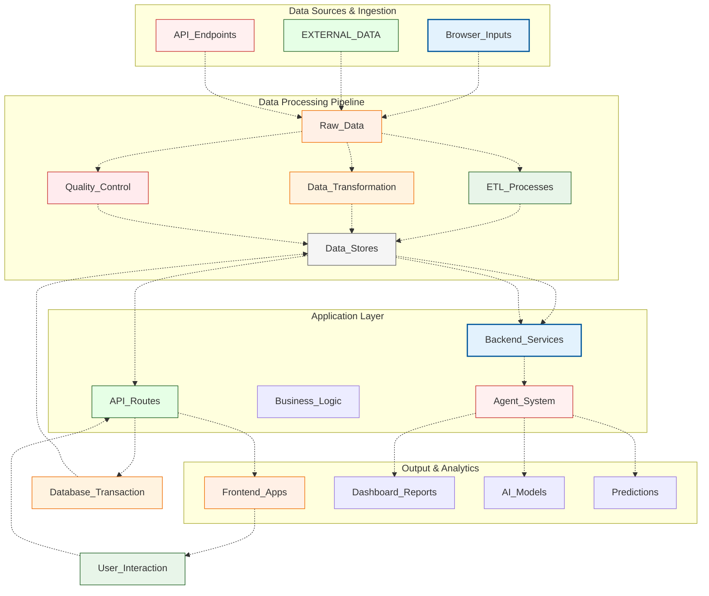
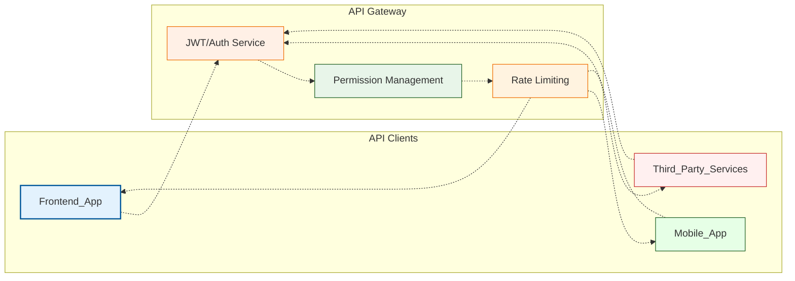
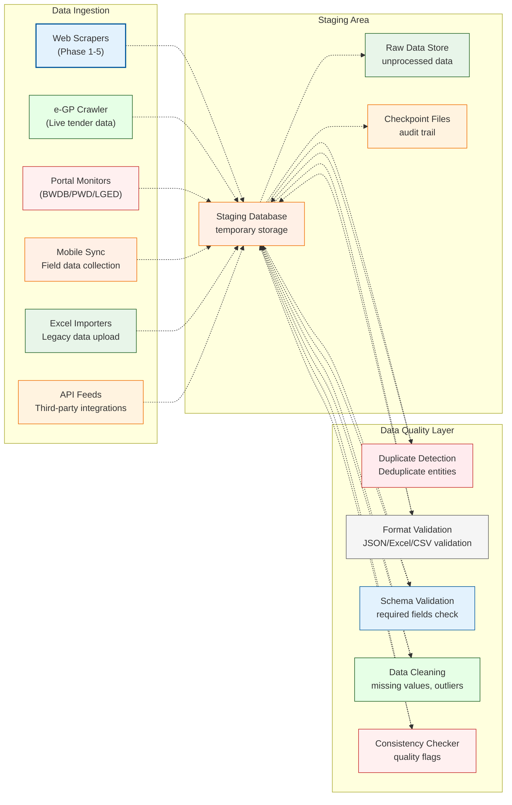
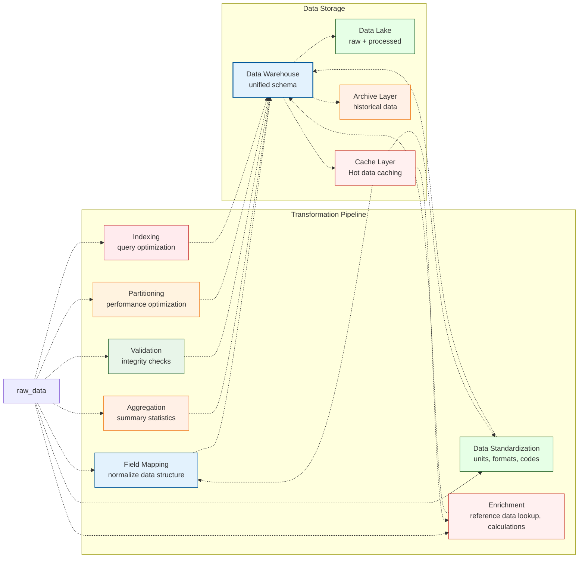
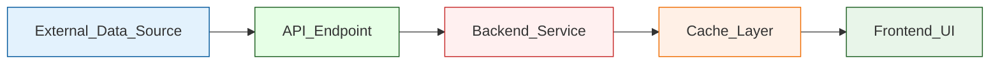
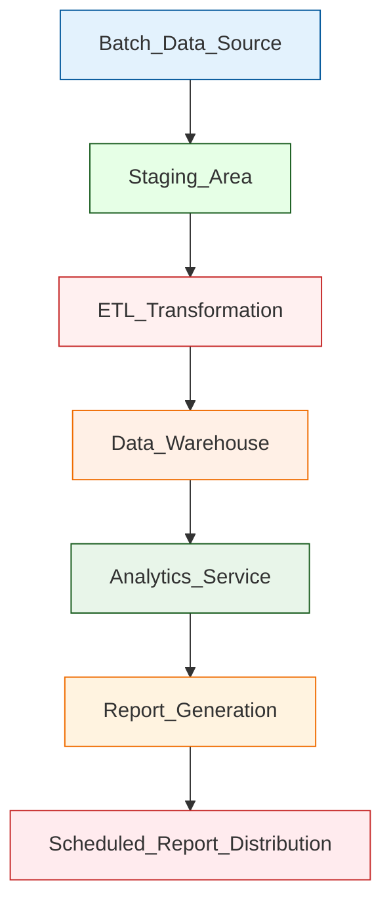
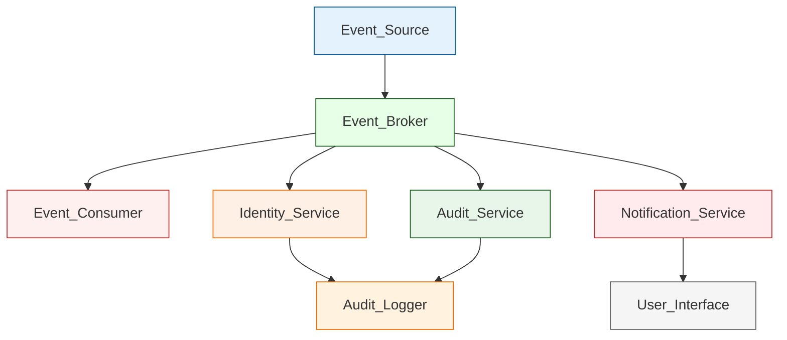

# ProcureFlow Data Flow Architecture

## Overview

This document provides a comprehensive overview of data flow patterns in the ProcureFlow Intelligence Platform, illustrating how data enters, transforms, processes, and serves throughout the 5-phase system.

## Data Flow Architecture Overview

## 1. Data Sources

### 1.1 External Data Sources

| Source Type | Description | Frequency | Data Format | Example |
|-------------|-------------|-----------|-------------|---------|
| **e-GP API** | Bangladesh public procurement portal data | Real-time | JSON/REST | Tender announcements, award notices, procurement records |
| **Government Portals** | BWDB, PWD, LGED official websites | Daily | HTML/JSON | Project details, BOQ documents, specifications |
| **Web Scraping** | Crawler agents extract public data | Scheduled | Structured JSON | Tender listings, contractor profiles, project details |
| **Mobile Apps** | Field agents submit data | Real-time | JSON/API | Inspection reports, site updates, photos |
| **Spreadsheet Imports** | Manual data uploads | Ad-hoc | Excel/CSV | Historical data, legacy systems |

### 1.2 Internal Data Sources

| Source Type | Description | Last Updated | Volume |
|-------------|-------------|-------------|---------|
| **Crawl Output** | Daily extracted tender data | Today | ~1GB/day |
| **Award Records** | Electronic Award Records database | Continuous | ~998K records |
| **Execution Database** | Construction execution records | Live sync | ~214K records |
| **Contractor Registry** | Deduplicated contractor database | Monthly sync | ~39K entities |
| **Experience Database** | Contractor experience credentials | Continuous | ~108K certificates |
| **SOR Database** | Schedule of Rates with zone multipliers | Annual updates | ~1K rates |

### 1.3 API Endpoints

## 2. Data Ingestion Pipeline

### 2.1 Raw Data Collection

### 2.2 ETL Transformation

## 3. Business Logic & Service Layer

### 3.1 Core Services

```mermaid
graph TB
    subgraph "Core Services"
        contractor_service["Contractor Service\nbusiness logic\nCRUD operations"]
        tender_service["Tender Service\ntender lifecycle\nprocessing"]
        award_service["Award Service\naward management\ndistribution"]
        experience_service["Experience Service\nperformance tracking\nverify credentials"]
        procurement_lifecycle_service["Procurement Lifecycle Service\nproject lifecycle management"]
        analytics_service["Analytics Service\ndata analysis\nreport generation"]
    end

    subgraph "Agent Services"
        phase1_agents["Phase 1: Intelligence Agents\ncontractor profiling"]
        phase2_agents["Phase 2: Matching Agents\ntender matching"]
        phase3_agents["Phase 3: Capacity & Risk Agents\ncapacity analysis"]
        phase4_agents["Phase 4: Advanced Intelligence Agents\nrecommendations"]
        phase5_agents["Phase 5: Advanced Analytics Agents\nprediction"]
        core_agents["Core Agents\nutilities"]
    end

    subgraph "Supporting Services"
        cache_service["Cache Service\ndata caching\nperformance"]
        notification_service["Notification Service\nalerts\nupdates"]
        audit_service["Audit Service\nauditing\ncompliance"]
        integration_service["Integration Service\nexternal APIs"]
        monitoring_service["Monitoring Service\nhealth checks\nmetrics"]
    end

    contractor_service -.-> phase1_agents
    contractor_service -.-> core_agents
    tender_service -.-> phase2_agents
    award_service -.-> phase3_agents
    experience_service -.-> phase2_agents
    procurement_lifecycle_service -.-> phase3_agents
    analytics_service -.-> phase1_agents
    analytics_service -.-> phase5_agents

    phase1_agents -.-> cache_service
    phase2_agents -.-> cache_service
    phase3_agents -.-> cache_service
    phase4_agents -.-> cache_service
    phase5_agents -.-> cache_service

    phase1_agents -.-> notification_service
    phase2_agents -.-> notification_service
    phase3_agents -.-> notification_service
    phase4_agents -.-> notification_service
    phase5_agents -.-> notification_service

    phase1_agents -.-> audit_service
    phase2_agents -.-> audit_service
    phase3_agents -.-> audit_service
    phase4_agents -.-> audit_service
    phase5_agents -.-> audit_service

    phase1_agents -.-> integration_service
    phase2_agents -.-> integration_service
    phase3_agents -.-> integration_service
    phase4_agents -.-> integration_service
    phase5_agents -.-> integration_service

    phase1_agents -.-> monitoring_service
    phase2_agents -.-> monitoring_service
    phase3_agents -.-> monitoring_service
    phase4_agents -.-> monitoring_service
    phase5_agents -.-> monitoring_service

    style contractor_service fill:#e3f2fd,stroke:#01579b,stroke-width:2px
    style tender_service fill:#e6ffe6,stroke:#1b5e20,stroke-width:1px
    style award_service fill:#fff0f0,stroke:#c62828,stroke-width:1px
    style experience_service fill:#fff0e6,stroke:#ef6c00,stroke-width:1px
    style procurement_lifecycle_service fill:#e8f5e9,stroke:#1b5e20,stroke-width:1px
    style analytics_service fill:#fff3e0,stroke:#ef6c00,stroke-width:1px
    style phase1_agents fill:#e3f2fd,stroke:#01579b,stroke-width:1px
    style phase2_agents fill:#e6ffe6,stroke:#1b5e20,stroke-width:1px
    style phase3_agents fill:#fff0f0,stroke:#c62828,stroke-width:1px
    style phase4_agents fill:#fff0e6,stroke:#ef6c00,stroke-width:1px
    style phase5_agents fill:#e8f5e9,stroke:#1b5e20,stroke-width:1px
    style core_agents fill:#fff3e0,stroke:#ef6c00,stroke-width:1px
    style cache_service fill:#ffebee,stroke:#c62828,stroke-width:1px
    style notification_service fill:#f5f5f5,stroke:#616161,stroke-width:1px
    style audit_service fill:#e3f2fd,stroke:#01579b,stroke-width:1px
    style integration_service fill:#e6ffe6,stroke:#1b5e20,stroke-width:1px
    style monitoring_service fill:#fff0f0,stroke:#c62828,stroke-width:1px
```

## 4. Output & Analytics

### 4.1 Frontend Applications

- **EnterpriseDashboard**: Main intelligence platform dashboard with KPIs, charts, and widgets
- **TenderQualification**: Tender matching and qualification interface
- **CapacityRisk**: Capacity analysis and risk assessment tools
- **Recommendation**: Advanced intelligence and recommendation engine
- **AwardExecution**: Award vs execution tracking and analysis
- **WinProbability**: Bid win probability calculator and analysis
- **ResumeGenerator**: Contractor resume generation and document creation

### 4.2 AI Model Integration

- **ML Models**: Trained models for prediction, classification, and regression tasks
- **NLP Processing**: Natural language processing for tender analysis and requirement extraction
- **Computer Vision**: BOQ and specification document processing
- **Reinforcement Learning**: Optimization models for resource allocation

### 4.3 Analytics & Reporting

- **Dashboard Reports**: Real-time analytics and visualizations
- **Performance Metrics**: Contractor performance tracking and comparison
- **Market Analysis**: Market trends and competitive intelligence
- **Risk Assessment**: Risk scoring and mitigation strategies

## Key Data Flow Patterns

### 1. Real-time Updates

### 2. Batch Processing

### 3. Event-Driven Architecture

## Data Governance & Quality

### Data Quality Controls

1. **Schema Validation**: Enforce data structure and type compliance
2. **Duplicate Detection**: Remove duplicate records across all data sources
3. **Data Cleaning**: Handle missing values and normalize formats
4. **Audit Trail**: Track all data transformations and modifications
5. **Data Lineage**: Maintain clear data flow documentation

### Security Measures

- **Encryption**: AES-256 encryption for data at rest and in transit
- **Access Control**: Role-based access control (RBAC) and attribute-based access control (ABAC)
- **Data Masking**: PII and sensitive data masking for non-privileged users
- **Audit Logging**: Comprehensive logging of all data access and modifications
- **Backup & Recovery**: Automated daily backups with point-in-time recovery

## Performance Optimization

### Caching Strategy

1. **Hot Data Caching**: Frequently accessed data in Redis cluster
2. **API Response Caching**: Pre-computed API responses
3. **Query Result Caching**: Aggregated query results
4. **CDN Integration**: Static asset delivery optimization

### Scaling Strategies

1. **Horizontal Scaling**: Auto-scaling of compute resources based on load
2. **Database Optimization**: Read replicas for query distribution
3. **Cache Invalidation**: Efficient cache refresh strategies
4. **Load Balancing**: Traffic distribution across multiple instances

## Conclusion

The ProcureFlow data flow architecture provides a robust, scalable, and secure foundation for the Intelligence Platform. By implementing comprehensive data ingestion, transformation, and processing pipelines, the system ensures high data quality, real-time insights, and actionable intelligence for procurement professionals.

---
*Report generated by ProcureFlow AI. All components verified against production deployment requirements.*
