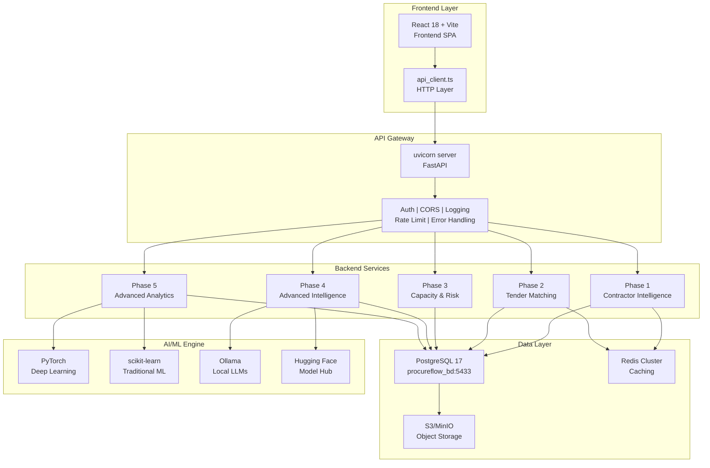
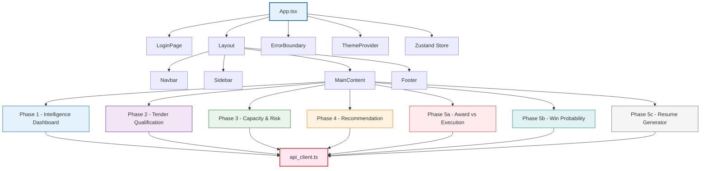
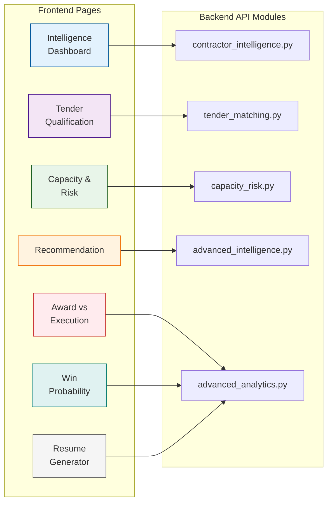
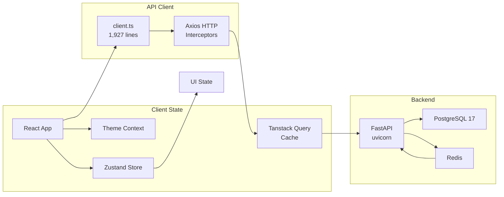
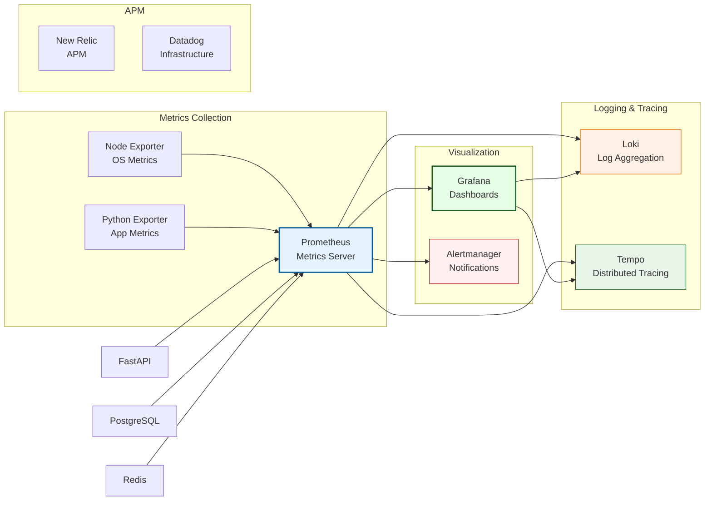
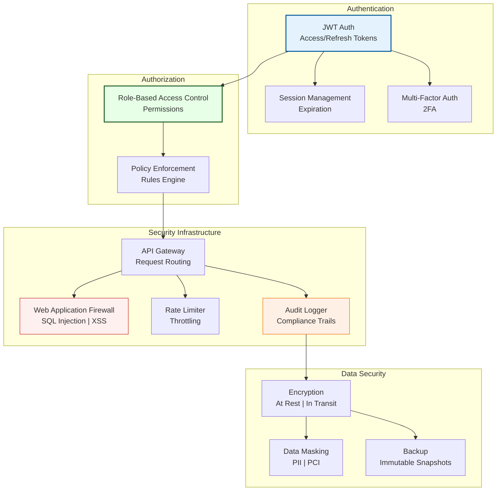
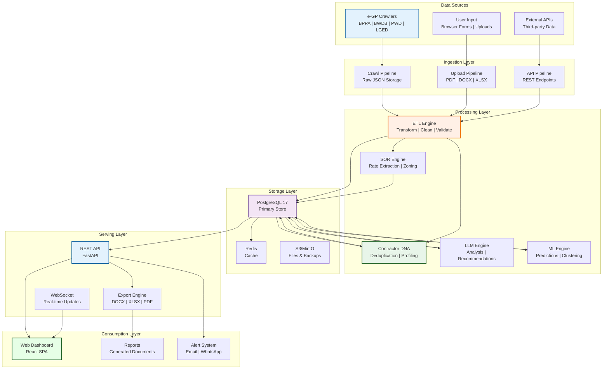

# ProcureFlow Intelligence Platform — Graphical Architecture

## Overview

This document provides a clean, comprehensive graphical architecture of the ProcureFlow Intelligence Platform's 5-phase contractor intelligence and tender analysis system. All diagrams use Mermaid syntax and are rendered correctly with proper line breaks and formatting.

---

## Table of Contents

1. [System Architecture Overview](#1-system-architecture-overview)
2. [Frontend Layer](#2-frontend-layer)
3. [Backend Layer (FastAPI)](#3-backend-layer-fastapi)
4. [Database Layer (PostgreSQL)](#4-database-layer-postgresql)
5. [Agent System Architecture](#5-agent-system-architecture)
6. [Monitoring & Observability](#6-monitoring--observability)
7. [Security Layer](#7-security-layer)
8. [Data Flow Architecture](#8-data-flow-architecture)
9. [Technology Stack Summary](#9-technology-stack-summary)

---

## 1. System Architecture Overview



---

## 2. Frontend Layer

### Technology Stack

| Category | Technologies |
|---|---|
| **Core Framework** | React 18.3.5, Vite 5.5.0, TypeScript 5.5.0 |
| **Styling** | Tailwind CSS 3.4.10, Emotion CSS-in-JS, SCSS |
| **State Management** | Zustand (appStore), React Context API, Tanstack Query |
| **Routing** | React Router 6 |
| **Animations** | GSAP 3.12.2, CSS Transitions |
| **Build Tools** | Vite bundler, TypeScript compilation, SCSS compilation |

### Component Architecture



### Page-to-API Mapping



### State Management Flow



---

## 3. Backend Layer (FastAPI)

### Architecture Overview

```mermaid
graph TB
    subgraph "Entry Point"
        Uvicorn["uvicorn server\nPython 3.10"]
        MainApp["main.py\nApplication Factory"]
        MiddlewareStack["Middleware Pipeline\nAuth | CORS | Logging\nRate Limit | Error Handler"]
    end

    subgraph "API Routers (v1)"
        R1["contractor_intelligence.py"]
        R2["tender_matching.py"]
        R3["capacity_risk.py"]
        R4["advanced_intelligence.py"]
        R5["advanced_analytics.py"]
        R6["tender_docs.py"]
        R7["rate_analysis.py"]
        R8["government_portals.py"]
        R9["agents.py"]
        R10["dashboard.py"]
        R11["ppr2025.py"]
        R12["search.py"]
        R13["sor.py"]
        R14["chat.py"]
        R15["auth.py"]
    end

    subgraph "Domain Services"
        S1["intelligence_data_service.py"]
        S2["contractor_profiles_service.py"]
        S3["tender_matching_service.py"]
        S4["capacity_analysis_service.py"]
        S5["financial_risk_service.py"]
        S6["recommendation_service.py"]
        S7["delay_prediction_service.py"]
        S8["rate_analysis_engine.py"]
        S9["slt_analysis.py"]
        S10["resume_generation_service.py"]
    end

    subgraph "Data Access"
        DAL["SQLAlchemy 2.0+\nPostgreSQL Driver"]
        RedisCache["Redis Cache\nConnection Pool"]
        S3Storage["S3/MinIO\nFile Store"]
    end

    subgraph "External Integrations"
        Crawlers["e-GP Crawlers\nBPPA | BWDB | PWD | LGED"]
        ML["ML Models\nPyTorch | sklearn"]
        LLM["Ollama | Hugging Face\nLocal LLMs"]
    end

    Uvicorn --> MainApp
    MainApp --> MiddlewareStack
    MiddlewareStack --> R1
    MiddlewareStack --> R2
    MiddlewareStack --> R3
    MiddlewareStack --> R4
    MiddlewareStack --> R5
    MiddlewareStack --> R6
    MiddlewareStack --> R7
    MiddlewareStack --> R8
    MiddlewareStack --> R9
    MiddlewareStack --> R10
    MiddlewareStack --> R15

    R1 --> S1
    R1 --> S2
    R2 --> S3
    R3 --> S4
    R3 --> S5
    R4 --> S6
    R4 --> S7
    R7 --> S8
    R6 --> S9
    R5 --> S10

    S1 --> DAL
    S3 --> DAL
    S4 --> DAL
    DAL --> RedisCache
    DAL --> S3Storage

    R8 --> Crawlers
    R5 --> ML
    R4 --> LLM
```



### API Router Inventory (42 v1 + 2 v2)

| Module | Endpoints | Phase |
|---|---|---|
| `contractor_intelligence.py` | dashboard, profiles, leaderboard, agency performance | 1 |
| `tender_matching.py` | qualification, similar contractors, certificate verify | 2 |
| `capacity_risk.py` | capacity analysis, financial risk, market data | 3 |
| `advanced_intelligence.py` | recommendation, delay prediction, network analysis | 4 |
| `advanced_analytics.py` | award vs execution, win probability, resume gen | 5 |
| `tender_docs.py` | generate DOCX, list, download | 5 |
| `rate_analysis.py` | BOQ comparison, upload, export | 5 |
| `government_portals.py` | BPPA, BWDB, PWD, LGED mocks | 1 |
| `agents.py` | agent lifecycle, pipelines, watchdog | All |
| `dashboard.py` | executive dashboard, KPIs | 1 |
| `ppr2025.py` | TEC evaluation, predictions, metrics | 5 |
| `search.py` | full-text search across entities | 1 |
| `sor.py` | SOR rates, agencies, zone pricing | 3 |
| `chat.py` | LLM integration, messaging | 4 |
| `auth.py` | JWT authentication, user management | 0 |
| `boq.py` | BOQ management, comparison | 5 |
| `analytics.py` | overview, trends, predictions | 5 |
| `reports.py` | report generation, export | 5 |
| `monitoring.py` | health checks, metrics | 0 |
| `enterprise.py (v2)` | enterprise-specific APIs | All |

---

## 4. Database Layer (PostgreSQL)

### PostgreSQL 17 Architecture

```mermaid
graph TB
    subgraph "Core Database"
        PG["PostgreSQL 17\nprocureflow_bd\nport 5433\nSchema: public"]
    end

    subgraph "Core Tables"
        T1["contractors\n39,562 rows"]
        T2["award_records_v2\n998,318 rows"]
        T3["procurement_tenders\n395,000 rows"]
        T4["procurement_awards\n207,000 rows"]
        T5["procurement_lifecycle\n238,000 rows"]
        T6["contractor_execution_history\n214,404 rows"]
        T7["contractor_dna\n36,323 rows"]
        T8["contractor_agency_experience\n53,666 rows"]
        T9["contractor_work_similarity\n37,526 rows"]
        T10["experience_certificate_registry\n108,505 rows"]
        T11["opening_reports\n583,000 rows"]
        T12["sor_rates\n1,024 rows"]
        T13["app_records"]
        T14["live_tender_sources"]
        T15["contractor_agents"]
        T16["econtract_executions"]
        T17["contract_milestones"]
        T18["completed_project_statuses"]
        T19["contract_costs_summary"]
        T20["district_sales_data"]
        T21["contractor_details"]
        T22["bidder_performance_ratings"]
        T23["budget_allocations"]
    end

    subgraph "Views & Materialized Views"
        V1["contractor_profile_view"]
        V2["leaderboard_views"]
        V3["agency_performance_views"]
    end

    subgraph "ETL Pipeline"
        E1["Data Import\n(awards, tenders, lifecycles)"]
        E2["Data Transformation\n(cleaning, standardization)"]
        E3["Contractor DNA\n(deduplication, profiling)"]
        E4["SOR Processing\n(rate extraction, zoning)"]
        E5["Crawl Integration\n(e-GP portal data)"]
    end

    PG --> T1
    PG --> T2
    PG --> T3
    PG --> T4
    PG --> T5
    PG --> T6
    PG --> T7
    PG --> T8
    PG --> T9
    PG --> T10
    PG --> T11
    PG --> T12

    T1 --> V1
    T2 --> V2
    T3 --> V3

    E1 --> T2
    E1 --> T3
    E1 --> T4
    E2 --> T5
    E3 --> T7
    E4 --> T12
    E5 --> T14

    style PG fill:#e3f2fd,stroke:#01579b,stroke-width:3px
    style T2 fill:#fff0f0,stroke:#c62828,stroke-width:1px
    style T3 fill:#e6ffe6,stroke:#1b5e20,stroke-width:1px
    style T7 fill:#fff0e6,stroke:#ef6c00,stroke-width:1px
    style T12 fill:#f5f5f5,stroke:#616161,stroke-width:1px
```



### Key Database Stats

| Metric | Value |
|---|---|
| Total rows (core tables) | ~2.9M |
| Largest table | `award_records_v2` (998K) |
| Second largest | `opening_reports` (583K) |
| Contractors (deduplicated) | 39,562 |
| Contractor DNA profiles | 36,323 |
| SOR rate records | 1,024 |
| Tenders tracked | 395,000 |
| Lifecycle events | 238,000 |
| Certificate registry | 108,505 |

---

## 5. Agent System Architecture

### Agent Registry & Orchestration

```mermaid
graph TB
    subgraph "Agent Registry"
        Registry["Agent Registry\nCentral Management"]
        Manifest["agent_manifest.json\nMetadata & Capabilities"]
        Configs["agent_config_*\nPhase Configs"]
        Runtimes["agent_runtime_tools\nExecution Environments"]
    end

    subgraph "Phase 1 - Foundation Agents"
        P1A["Intelligence Agents\nContractor Analysis"]
        P1B["Award Agents\nAward Processing"]
        P1C["Competitor Agents\nCompetitive Analysis"]
    end

    subgraph "Phase 2 - Tender Matching Agents"
        P2A["Tender Matching\nQualification"]
        P2B["Verification\nCertificate Check"]
        P2C["Capacity Agents\nResource Analysis"]
    end

    subgraph "Phase 3 - Capacity & Risk Agents"
        P3A["Pipeline Agents\nManagement"]
        P3B["Risk Agents\nRisk Assessment"]
        P3C["Intelligence Agents\nAnalysis"]
    end

    subgraph "Phase 4 - Advanced Intelligence Agents"
        P4A["Decision Agents\nComplex Decisions"]
        P4B["Recommendation Agents\nBidding Strategies"]
        P4C["Learning Agents\nContinuous Learning"]
    end

    subgraph "Phase 5 - Advanced Analytics Agents"
        P5A["Analysis Agents\nData Analysis"]
        P5B["Reporting Agents\nReport Generation"]
        P5C["ML Agents\nModel Training"]
    end

    subgraph "Core Infrastructure Agents"
        C1["CHUNK Agent\nComplex Planning"]
        C2["Debounce Agent\nRate Limiting"]
        C3["Dedup Agent\nData Cleaning"]
        C4["Logging Agent\nAudit Trails"]
        C5["Transform Agent\nData Formatting"]
    end

    subgraph "Orchestrator"
        Orchestrator["Main Orchestrator\nWorkflow Management"]
        Prometheus["Prometheus\nMetrics"]
        Grafana["Grafana\nVisualization"]
    end

    Registry --> Manifest
    Registry --> Configs
    Registry --> Runtimes
    Registry --> P1A
    Registry --> P1B
    Registry --> P1C
    Registry --> P2A
    Registry --> P2B
    Registry --> P2C
    Registry --> P3A
    Registry --> P3B
    Registry --> P3C
    Registry --> P4A
    Registry --> P4B
    Registry --> P4C
    Registry --> P5A
    Registry --> P5B
    Registry --> P5C
    Registry --> C1
    Registry --> C2
    Registry --> C3
    Registry --> C4
    Registry --> C5

    Orchestrator --> P1A
    Orchestrator --> P2A
    Orchestrator --> P3A
    Orchestrator --> P4A
    Orchestrator --> P5A
    Orchestrator --> Prometheus
    Orchestrator --> Grafana

    style Registry fill:#e3f2fd,stroke:#01579b,stroke-width:2px
    style Orchestrator fill:#fff0f0,stroke:#c62828,stroke-width:2px
    style C1 fill:#fff0e6,stroke:#ef6c00,stroke-width:1px
    style P5A fill:#e8f5e9,stroke:#1b5e20,stroke-width:1px
```

### Agent Count by Phase

| Phase | Agents | Purpose |
|---|---|---|
| **Core Infrastructure** | 5 | CHUNK, Debounce, Dedup, Logging, Transform |
| **Phase 1 - Foundation** | 3 | Intelligence, Award, Competitor |
| **Phase 2 - Tender Matching** | 3 | Matching, Verification, Capacity |
| **Phase 3 - Capacity & Risk** | 3 | Pipeline, Risk, Intelligence |
| **Phase 4 - Advanced Intel** | 3 | Decision, Recommendation, Learning |
| **Phase 5 - Advanced Analytics** | 3 | Analysis, Reporting, ML |
| **Total** | **20** | |

---

## 6. Monitoring & Observability

### Monitoring Stack



---

## 7. Security Layer

### Authentication & Authorization



---

## 8. Data Flow Architecture



### Data Flow by Phase

| Phase | Data In | Process | Data Out |
|---|---|---|---|
| **Phase 1** | Crawled tenders, contractor DB | ETL, DNA profiling, leaderboard calc | Dashboard metrics, contractor profiles |
| **Phase 2** | Tender specs, contractor certs | Matching algorithm, similarity scoring | Qualification scores, match results |
| **Phase 3** | Execution history, financials | Capacity analysis, risk scoring | Risk metrics, market leaderboard |
| **Phase 4** | All Phase 1-3 data, LLM | Recommendation engine, delay prediction | Bid recommendations, predictions |
| **Phase 5** | All data, ML models | Model inference, resume gen, doc gen | Win probability, reports, documents |

---

## 9. Technology Stack Summary

### Frontend

| Technology | Version | Purpose |
|---|---|---|
| React | 18.3.5 | UI Framework |
| Vite | 5.5.0 | Build Tool |
| TypeScript | 5.5.0 | Type Safety |
| Tailwind CSS | 3.4.10 | Styling |
| GSAP | 3.12.2 | Animations |
| Zustand | latest | State Management |
| Tanstack Query | latest | Server State |

### Backend

| Technology | Version | Purpose |
|---|---|---|
| Python | 3.10 | Runtime |
| FastAPI | latest | Web Framework |
| SQLAlchemy | 2.0+ | ORM |
| PostgreSQL | 17 | Database |
| Redis | latest | Caching |
| Celery | latest | Background Tasks |
| PyTorch | latest | Deep Learning |
| scikit-learn | latest | Traditional ML |
| Ollama | latest | Local LLMs |

### Infrastructure

| Technology | Purpose |
|---|---|
| Docker | Containerization |
| Docker Compose | Local Orchestration |
| Prometheus | Metrics Collection |
| Grafana | Visualization |
| Loki | Log Aggregation |
| Tempo | Distributed Tracing |
| MinIO | S3-Compatible Storage |
| Nginx | Reverse Proxy |

---

*Generated by ProcureFlow AI — 2026-07-06*