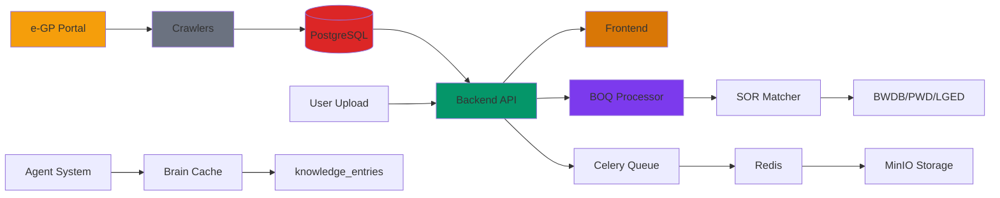

# Project Visit Graph — ProcurementFlow
**Date:** June 30, 2026  
**Project:** ProcurementFlow Specialist BD  
**Path:** `D:\A1\procurementflow_final_v3\procurementflow`

---

## Overview

This document contains a Mermaid graph representing the complete project structure discovered during the repository visit. The project is a comprehensive enterprise procurement intelligence platform focused on Bangladesh's e-GP (Electronic Government Procurement) system.

---

## Full Project Structure Graph

```mermaid
graph TD
    A[ProcurementFlow Root] --> B[Backend FastAPI]
    A --> C[Frontend React SPA]
    A --> D[Docker Compose]
    A --> E[Crawlers]
    A --> F[Agent System]
    A --> G[Database]
    A --> H[Utilities & Scripts]
    
    B --> B1[API v1 - 33 endpoints]
    B --> B2[API v2 - Enterprise]
    B --> B3[Core Config/Security]
    B --> B4[Models - 11 ORM]
    B --> B5[Services - 58 modules]
    B --> B6[SOR System]
    B --> B7[Celery Worker]
    B --> B8[e-GP Client]
    
    B1 --> B1a[awards.py]
    B1 --> B1b[boq.py]
    B1 --> B1c[tenders.py]
    B1 --> B1d[sor.py]
    B1 --> B1e[intelligence.py]
    B1 --> B1f[analytics.py]
    B1 --> B1g[agents.py]
    B1 --> B1h[chat.py]
    B1 --> B1i[search.py]
    B1 --> B1j[reports.py]
    
    B2 --> B2a[enterprise.py]
    
    B5 --> B5a[boq_processor.py]
    B5 --> B5b[pdf_parser.py]
    B5 --> B5c[sor_etl.py]
    B5 --> B5d[ppr_engine.py]
    B5 --> B5e[bid_predictor.py]
    B5 --> B5f[contractor_dna.py]
    B5 --> B5g[data_intelligence.py]
    
    B6 --> B6a[BWDB 1024 rates]
    B6 --> B6b[PWD 2018 rates]
    B6 --> B6c[LGED 1503 rates]
    
    F --> F1[Discovery Agents]
    F --> F2[Acquisition Agents]
    F --> F3[Decision Agents]
    F --> F4[Evaluation Agents]
    F --> F5[Intelligence Agents]
    F --> F6[Competitor Agents]
    F --> F7[Orchestrators]
    F --> F8[Knowledge Agents]
    
    F1 --> F1a[Tender Radar]
    F1 --> F1b[Tender Acquisition]
    F1 --> F1c[Corrigendum Watchdog]
    F1 --> F1d[Material Price Crawler]
    F1 --> F1e[Vision Intelligence]
    
    F2 --> F2a[e-GP Download]
    F2 --> F2b[Subprocess DL]
    
    C --> C1[Pages - 32]
    C --> C2[Components - 14]
    C --> C3[Zustand Stores]
    C --> C4[TanStack Query]
    C --> C5[Recharts]
    
    C1 --> C1a[Dashboard]
    C1 --> C1b[LiveTenders]
    C1 --> C1c[UploadCompare]
    C1 --> C1d[Analytics]
    C1 --> C1e[PPR2025]
    C1 --> C1f[DataIntelligence]
    C1 --> C1g[AgentPipeline]
    C1 --> C1h[TenderDocumentAI]
    
    G --> G1[PostgreSQL 17]
    G --> G2[Alembic Migrations]
    G --> G3[Schema + Seed SQL]
    G --> G4[14+ Tables]
    
    D --> D1[Backend Container]
    D --> D2[Worker Container]
    D --> D3[Frontend Container]
    D --> D4[Postgres Container]
    D --> D5[Redis Container]
    D --> D6[MinIO Container]
    D --> D7[Flower Monitor]
    
    E --> E1[crawl_live_tenders.py]
    E --> E2[crawl_all_deptree_awards.py]
    E --> E3[fetch_full_deptree.py]
    E --> E4[normalizer.py]
    E --> E5[discover_all_entities.py]
    
    H --> H1[setup.bat]
    H --> H2[start_all.bat]
    H --> H3[verify_local.sh]
    H --> H4[RUN_ON_NEW_MACHINE.txt]
    
    style A fill:#2563eb
    style B fill:#059669
    style C fill:#d97706
    style F fill:#7c3aed
    style G fill:#dc2626
    style D fill:#0891b2
    style E fill:#4b5563
    style H fill:#9ca3af
```

---

## Data Flow Diagram

---

## Component Summary

### Root Directories

| Directory | Purpose | Item Count |
|-----------|---------|------------|
| `backend/` | Python FastAPI backend with API, services, models, agents | 38+ entries |
| `frontend/` | React/TypeScript/Vite single-page application | 18 entries |
| `crawler/` | Web scraping scripts for e-GP data | 42 files |
| `scripts/` | Utility scripts | Variable |
| `storage/` | Local file storage | Variable |
| `tools/` | Developer tooling | Variable |
| `.memory/` | AI agent memory and fix logs | 3 entries |
| `.agents/` | Agent configurations | Variable |

### Backend Modules

| Module | Count | Description |
|--------|-------|-------------|
| API endpoints (v1) | 33 | RESTful endpoints covering all domains |
| API endpoints (v2) | 1 | Enterprise-specific endpoints |
| Services | 58 | Business logic modules |
| Models | 11 | SQLAlchemy ORM definitions |
| Agents | 29 | AI agent implementations |
| SOR submodules | 3 | Agency-specific rate data |

### Frontend Modules

| Module | Count | Description |
|--------|-------|-------------|
| Pages | 32 | Full page components |
| Components | 14 | Shared UI components |
| API client | 1 | Axios-based API layer |
| Stores | Variable | Zustand state management |

### Agent Distribution

| Category | Count | Key Files |
|----------|-------|-----------|
| Discovery | 6 | tender_radar.py, corrigendum_watchdog.py |
| Acquisition | 2 | tender_acquisition.py, _sub_dl.py |
| Decision | Variable | Decision logic modules |
| Evaluation | Variable | Evaluation logic modules |
| Intelligence | Variable | Intelligence modules |
| Competitor | Variable | Competitor analysis |
| Pricing | Variable | Pricing optimization |
| Learning | Variable | Post-MVP learning |
| Orchestrators | 2 | orchestrator.py, focused_awards_orchestrator.py |

### Services by Function

| Function | Example Files |
|----------|---------------|
| BOQ Processing | boq_processor.py, pdf_parser.py, excel_parser.py |
| SOR Operations | sor_etl.py, sor_ingestion.py, sor_service.py |
| Tender Intelligence | tender_extractor.py, tender_manager.py |
| Contractor Analysis | contractor_dna.py, contractor_dna_service.py |
| Price Analysis | rate_analysis_service.py, price_escalation.py |
| Validation | validation.py, validation_service.py |
| Reporting | boq_excel_generator.py, executive reports |
| Communication | notification_service.py, whatsapp_service.py |
| Database | agency_master_service.py, data_intelligence.py |

---

## Key File Locations

| File | Location | Purpose |
|------|----------|---------|
| Main API entry | `backend/app/main.py` | Unified FastAPI server |
| Celery app | `backend/app/celery_app.py` | Task queue setup |
| Database schema | `backend/database/schema.sql` | PostgreSQL DDL |
| DB migrations | `backend/alembic/` | Alembic version control |
| SOR service | `backend/app/sor/sor_service.py` | Rate lookup |
| e-GP client | `backend/app/agents/egp_client.py` | Bangladesh procurement API |
| Tender acquisition | `backend/app/agents/discovery/tender_acquisition.py` | e-GP download agent |
| Main page | `frontend/src/pages/DashboardPage.tsx` | Dashboard entry |
| App shell | `frontend/src/App.tsx` | React app root |
| Docker compose | `docker-compose.yml` (root) | Multi-service orchestration |
| Master plan | `PROCUREFLOW_MASTER_PLAN.md` | 405-line roadmap |
| Agent rules | `AGENTS.md` | AI agent guidelines |
| Memory index | `.memory/index.md` | Critical discoveries |

---

## Visit Summary

**Total items visited:** 75+ root entries, 38+ backend entries, 18+ frontend entries, 42+ crawler files

**Key Findings:**
1. Mature backend with 49 registered agents and 33 API endpoints
2. Modern React frontend with 32 pages and comprehensive component library
3. Heavy use of Windows batch scripts for local development
4. Extensive SOR integration across 3 government agencies (BWDB, PWD, LGED)
5. e-GP integration for Bangladesh public procurement
6. Brain knowledge architecture storing BOQ/TDS text
7. Docker Compose setup for production deployment
8. Multiple known bugs documented in master plan (JWT, imports, paths)

**Architecture Health:**
- ✅ BOQ parsing and SOR matching working
- ✅ 58 business logic services implemented
- ✅ 49 AI agents registered
- ✅ Docker Compose defined
- ⚠️ JWT auth not wired to routes
- ⚠️ Frontend dashboard broken (calls missing endpoint)
- ⚠️ PostgreSQL not actively used (JSON cache fallback)
- ⚠️ Several import path bugs documented

**Critical Path to Production:**
1. Fix BUGs 1-10 from master plan
2. Wire JWT auth to all routes
3. Activate PostgreSQL (replace JSON cache)
4. Fix frontend /api/boq/diff endpoint
5. Validate Docker compose paths
6. Complete Sprint 1: BOQ Extraction + Validation agents
