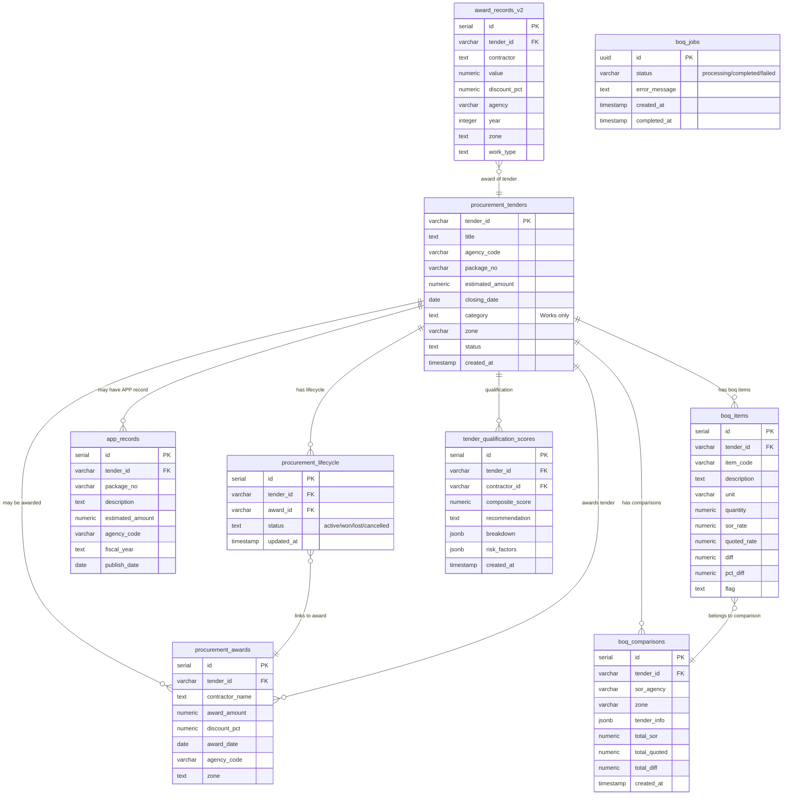

# ER-001: Tender & Award Domain

## Key Indexes

| Table | Index | Columns |
|-------|-------|---------|
| procurement_tenders | PK | tender_id |
| procurement_tenders | idx_agency | agency_code |
| procurement_tenders | idx_closing | closing_date |
| procurement_awards | idx_contractor | contractor_name |
| award_records_v2 | idx_contractor | contractor |
| award_records_v2 | idx_agency_year | agency, year |
| boq_items | idx_tender | tender_id |
