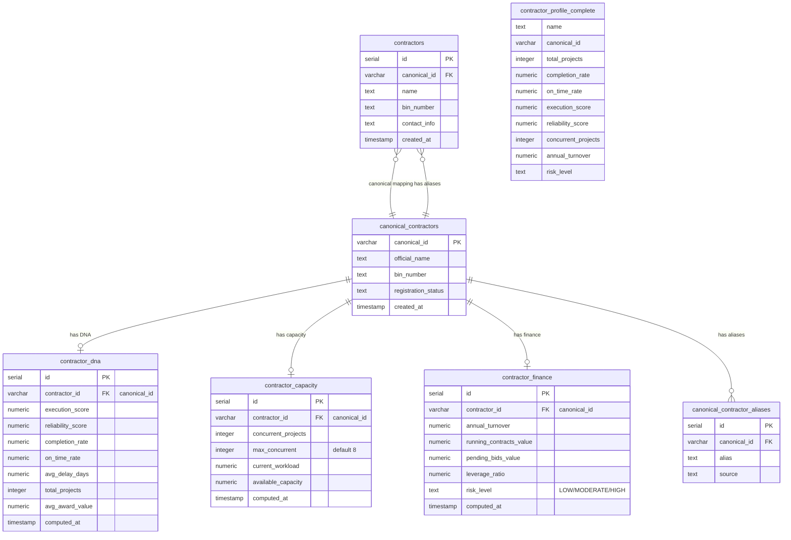

# ER-002: Contractor & DNA Domain



## DNA Score Computation

```
execution_score = (completion_rate × 40 + on_time_rate × 30 + reliability × 30) / 100
reliability_score = f(avg_delay_days, on_time_rate)
leverage_ratio = (running_contracts + pending_bids) / annual_turnover
```

## Capacity Metrics

| Metric | Formula | Alert Threshold |
|--------|---------|----------------|
| Utilization | concurrent / max_concurrent | > 0.85 |
| Available | max - concurrent | < 1 |
| Workload Ratio | current_workload / available | > 0.9 |
