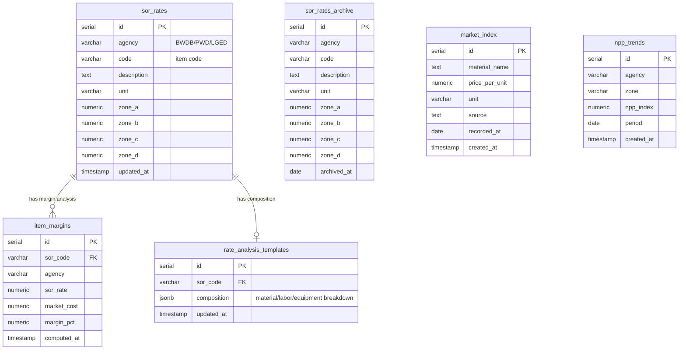

# ER-003: SOR & BOQ Domain

## SOR Code Patterns (Agency Detection)

| Agency | Pattern | Regex | Example |
|--------|---------|-------|---------|
| BWDB | `XX-XXX-XX` (dash-separated) | `^\d{2}-\d{3}-\d{2}` | `40-200-00` |
| PWD | `XX.XX...` (dotted, 2-digit prefix) | `^\d{2}\.\d` | `26.50.1` |
| LGED | `X.XX.XX...` (dotted, 1-digit prefix) | `^[2-9]\.\d{2}` | `4.09.01.01` |

## Zone Mapping (Division → Zone)

| Division | BWDB/PWD | LGED |
|----------|----------|------|
| Dhaka, Mymensingh | A | A |
| Chattogram, Sylhet | B | B |
| Khulna, Barishal | **C** | **D** |
| Rajshahi, Rangpur | **D** | **C** |
