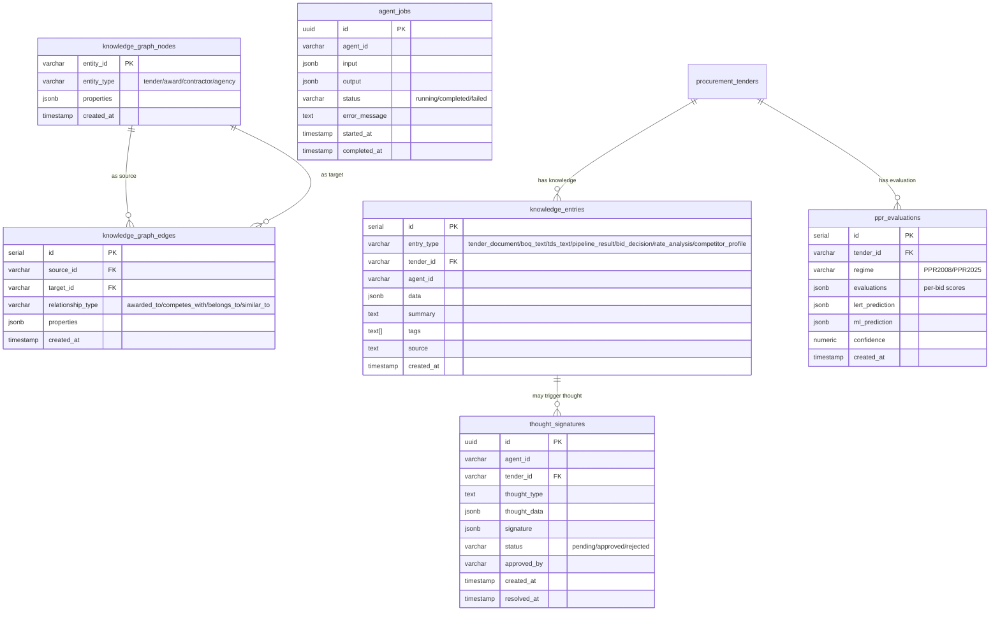

# ER-004: Knowledge & Agent Domain



## Knowledge Entry Types

| entry_type | Content | Stored By | Size Limit |
|------------|---------|-----------|------------|
| `tender_document` | Acquisition metadata + file paths | agent-002 | ~5KB |
| `boq_text` | Extracted BOQ PDF text | agent-002 | 50KB |
| `tds_text` | Extracted TDS PDF text | agent-002 | 50KB |
| `pipeline_result` | Pipeline completion summary | agent-027 | ~10KB |
| `bid_decision` | Bid/No-Bid rationale | agent-039 | ~5KB |
| `rate_analysis` | Item cost breakdowns | agent-011 | ~20KB |
| `competitor_profile` | Competitor intelligence | agent-013 | ~10KB |

## Knowledge Graph Relationships

```
TENDER --awarded_to--> CONTRACTOR
TENDER --belongs_to--> AGENCY
TENDER --similar_to--> TENDER
CONTRACTOR --competes_with--> CONTRACTOR
AWARD --awards_tender--> TENDER
```
