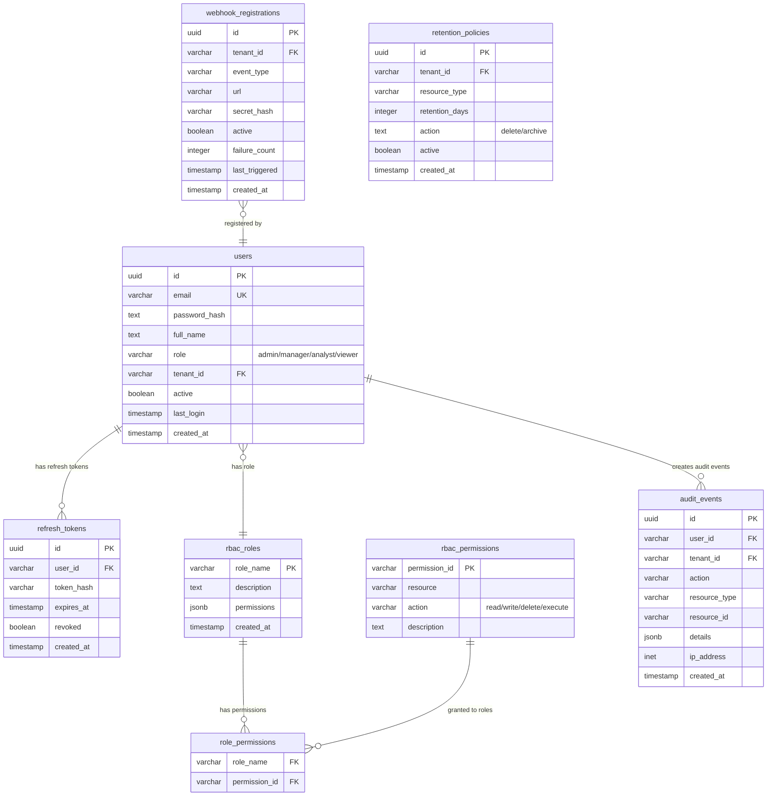

# ER-005: Enterprise & Auth Domain



## RBAC Matrix

| Role | Resources | Actions |
|------|-----------|---------|
| `admin` | * | * |
| `manager` | tenders, boq, agents, reports | read, write, execute |
| `analyst` | tenders, boq, reports, analytics | read |
| `viewer` | tenders, reports | read |

## Audit Event Schema

```json
{
  "id": "uuid",
  "user_id": "uuid",
  "tenant_id": "uuid",
  "action": "boq.compare",
  "resource_type": "boq_comparison",
  "resource_id": "123",
  "details": { "tender_id": "1298004", "items_count": 45 },
  "ip_address": "192.168.1.1",
  "created_at": "2026-07-24T02:00:00Z"
}
```

## Token Lifecycle

| Token | TTL | Storage | Refresh |
|-------|-----|---------|---------|
| Access Token | 15 min | Memory/cookie | No |
| Refresh Token | 7 days | DB (refresh_tokens) | Yes (one-time use) |
| SSO Token | IdP-dependent | Session | Via IdP |
