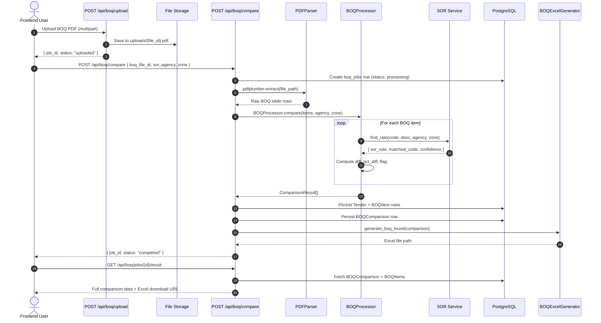

# SEQ-001: BOQ Upload & SOR Comparison

## Participants

| Actor/Component | Type | Description |
|----------------|------|-------------|
| Frontend User | Actor | Browser SPA initiating upload and comparison |
| POST /api/boq/upload | API | FastAPI endpoint for file upload |
| File Storage | Infra | Local filesystem `uploads/` directory |
| POST /api/boq/compare | API | FastAPI endpoint triggering comparison |
| PDFParser | Service | pdfplumber-based PDF text/table extraction |
| BOQProcessor | Service | Core matching engine against SOR databases |
| SOR Service | Service | In-memory SOR rate lookup (3 agencies) |
| PostgreSQL | DB | Persistent storage for jobs, items, comparisons |
| BOQExcelGenerator | Service | Multi-tab Excel report generation |

## Error Paths

1. **Invalid PDF** — `PDFParser` raises `ValueError` → API returns 422
2. **No BOQ table found** — `BOQProcessor` returns empty → API returns 404 with message
3. **SOR match failure** — Items without matches get `flag: "NO_SOR_MATCH"` in results
4. **Storage quota exceeded** — `FileUploadService` rejects before save → 413

## Timing

| Phase | Expected Duration |
|-------|-------------------|
| File upload + save | < 2s |
| PDF extraction | 3-15s (depends on PDF size) |
| SOR matching (per item) | < 50ms |
| Total comparison (100 items) | 5-20s |
| Excel generation | 2-5s |
