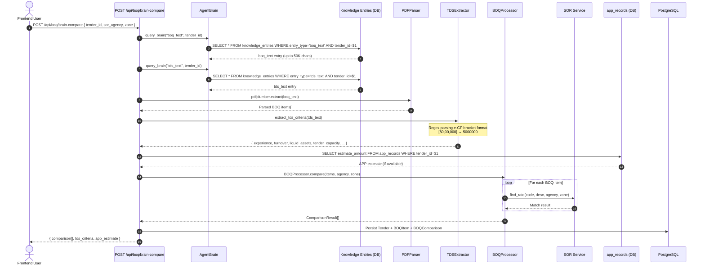

# SEQ-002: Brain-Based BOQ Comparison

## Participants

| Actor/Component | Type | Description |
|----------------|------|-------------|
| Frontend User | Actor | Browser SPA requesting brain comparison |
| AgentBrain | Agent Core | Central knowledge store + query engine |
| Knowledge Entries | DB | PostgreSQL table storing extracted texts |
| PDFParser | Service | BOQ text extraction from stored content |
| TDSExtractor | Service | Regex-based TDS financial criteria parsing |
| BOQProcessor | Service | SOR matching engine |
| SOR Service | Service | In-memory rate lookup |
| app_records | DB | APP plan records for estimate lookup |

## Key Differences from SEQ-001

- No file upload required — uses pre-acquired tender documents
- TDS criteria extraction included (7 financial fields)
- APP estimate lookup for context
- Relies on agent-002 having previously acquired documents

## Error Paths

1. **No knowledge entry found** — Brain returns empty → API returns 404 "Tender not acquired"
2. **BOQ text too large** — Truncated at 50K chars → partial extraction warning
3. **TDS parse failure** — Empty criteria returned with warning flags
