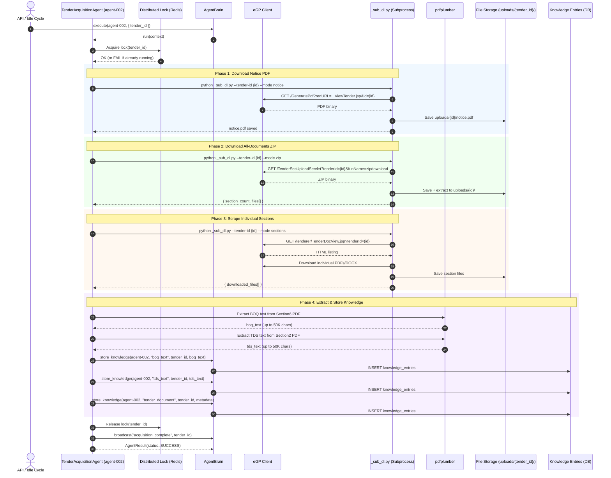

# SEQ-003: Full Tender Acquisition Pipeline

## Participants

| Actor/Component | Type | Description |
|----------------|------|-------------|
| API / Idle Cycle | Trigger | Manual API call or automatic idle cycle |
| TenderAcquisitionAgent | Agent | Orchestrates full document acquisition |
| Distributed Lock | Infra | Redis-based lock preventing concurrent downloads |
| AgentBrain | Agent Core | Knowledge storage + inter-agent messaging |
| eGP Client | External | HTTP client for eprocure.gov.bd portal |
| _sub_dl.py | Subprocess | Clean Python process for download (bypasses WinError 10060) |
| pdfplumber | Lib | PDF text extraction |
| File Storage | Infra | `backend/uploads/{tender_id}/` directory |
| Knowledge Entries | DB | PostgreSQL knowledge_entries table |

## Phases

| Phase | Duration | Output |
|-------|----------|--------|
| Notice PDF | 5-15s | notice.pdf |
| ZIP Download | 15-60s | Extracted sections |
| Section Scrape | 10-30s | Individual PDFs/DOCX |
| Knowledge Extraction | 5-20s | 3 knowledge entries |
| **Total** | **35-125s** | Complete tender package |

## Error Paths

1. **Lock already held** — Another acquisition running → return cached status
2. **e-GP session expired** — eGPClient re-authenticates, retries once
3. **ZIP download fails** — Subprocess retries 2x, falls back to individual downloads
4. **PDF extraction fails** — Empty boq_text/tds_text stored with warning flags
