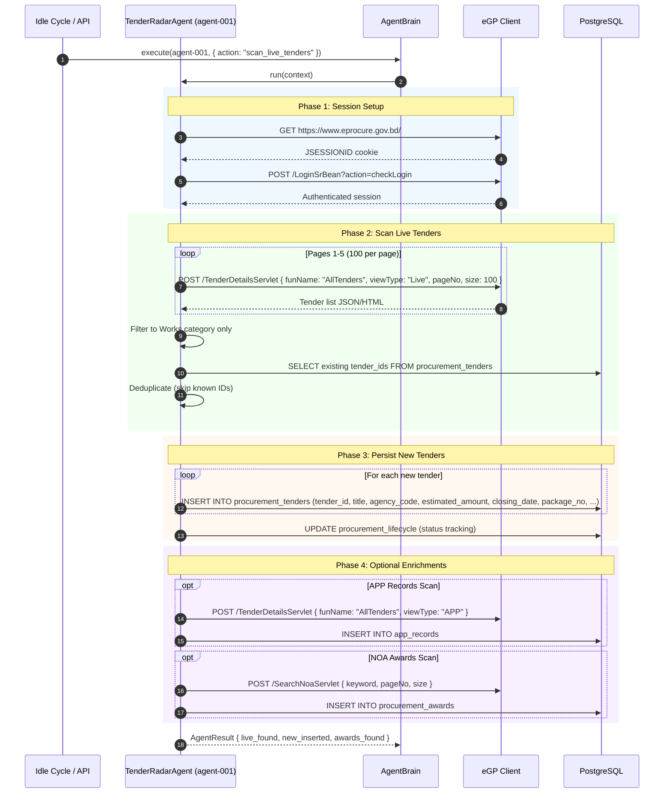

# SEQ-004: Tender Radar Scanning (e-GP Discovery)

## Participants

| Actor/Component | Type | Description |
|----------------|------|-------------|
| Idle Cycle / API | Trigger | Scheduled cron or manual trigger |
| TenderRadarAgent | Agent | e-GP discovery scanner |
| AgentBrain | Agent Core | Orchestrator + knowledge store |
| eGP Client | External | eprocure.gov.bd HTTP client |
| PostgreSQL | DB | Tender, award, and lifecycle tables |

## Data Volume

| Metric | Value |
|--------|-------|
| Pages scanned | Up to 5 (500 tenders max) |
| Filter | Works category only |
| Typical new tenders per scan | 5-20 |
| Deduplication | Tender ID against existing 395K |

## Error Paths

1. **e-GP unreachable** — Retry 3x with exponential backoff → return error status
2. **Session expired mid-scan** — Re-authenticate and resume from last page
3. **DB connection lost** — Retry with 5s delay, max 3 attempts
4. **Rate limiting** — e-GP blocks requests → back off 60s, reduce page count
