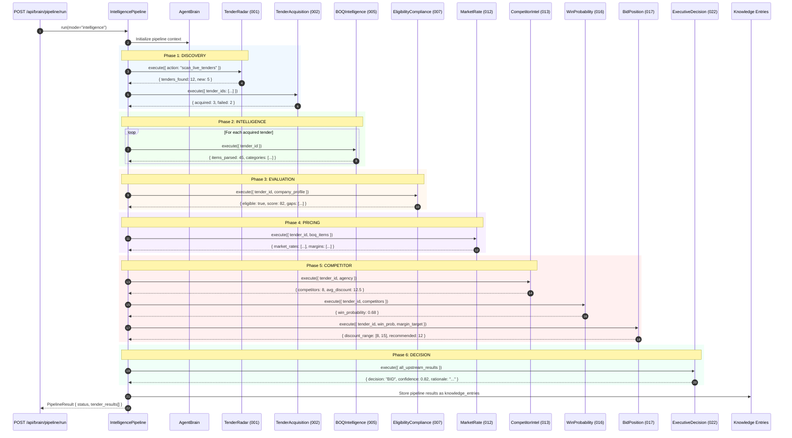

# SEQ-005: Intelligence Pipeline (Full Agent Chain)

## Pipeline Stages

| Stage | Agents | Output |
|-------|--------|--------|
| Discovery | 001, 002 | Tender list + acquired documents |
| Intelligence | 005 | Parsed BOQ items |
| Evaluation | 007 | Eligibility score |
| Pricing | 012 | Market rates + margins |
| Competitor | 013, 016, 017 | Competition analysis + bid position |
| Decision | 022 | Bid/No-Bid recommendation |

## Timing

| Phase | Duration |
|-------|----------|
| Discovery | 60-180s |
| Intelligence | 30-60s |
| Evaluation | 5-10s |
| Pricing | 10-20s |
| Competitor | 10-20s |
| Decision | 5-10s |
| **Total** | **120-300s** |

## Error Paths

1. **Agent timeout** — Pipeline marks stage as FAILED, continues with remaining stages
2. **Agent exception** — Logged, upstream context partially populated, decision uses available data
3. **All agents fail** — Pipeline returns status: DEGRADED with partial results
