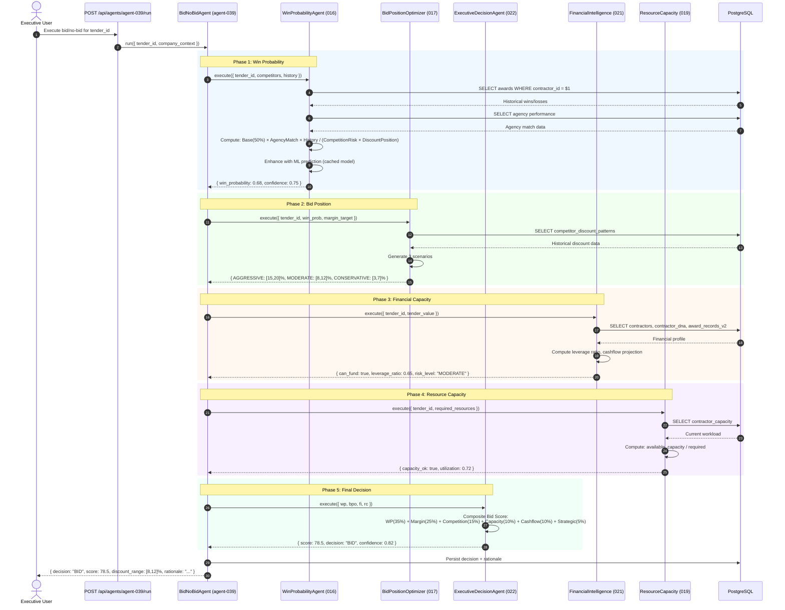

# SEQ-006: Bid/No-Bid Decision Engine



## Scoring Formula

```
Composite Score = (WinProbability × 35) + (MarginScore × 25) + (CompetitionScore × 15) + (CapacityScore × 10) + (CashflowScore × 10) + (StrategicScore × 5)
```

| Score Range | Decision |
|-------------|----------|
| ≥ 75 | **BID** — High confidence |
| 60-74 | **REVIEW** — Needs human review |
| < 60 | **NO-BID** — Skip opportunity |
