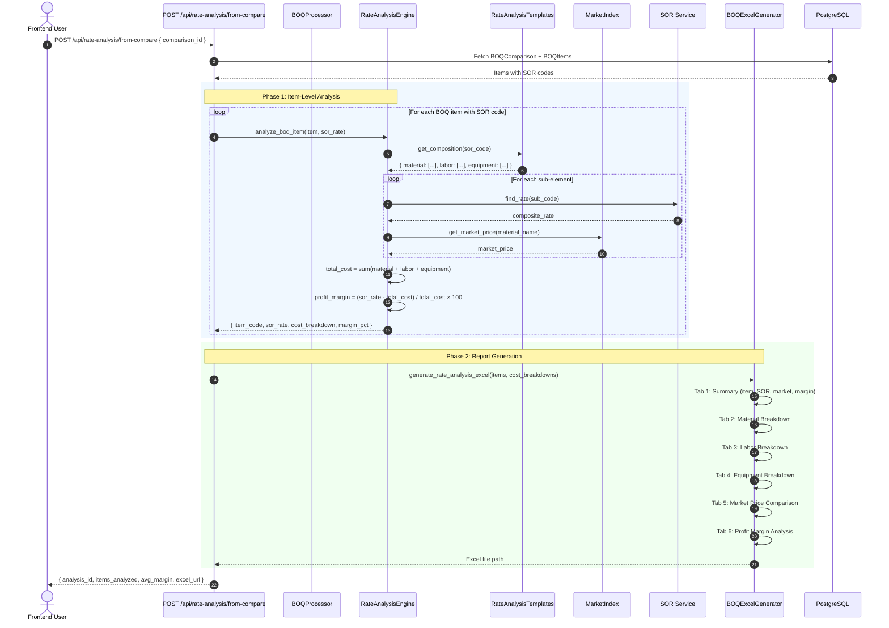

# SEQ-007: Rate Analysis with Market Comparison



## Cost Breakdown Structure

```
SOR Rate (100%)
├── Material Cost (typically 55-65%)
│   ├── Cement
│   ├── Steel
│   ├── Sand/Aggregate
│   ├── Bricks
│   └── Other materials
├── Labor Cost (typically 20-30%)
│   ├── Mason
│   ├── Carpenter
│   ├── Rod Bender
│   ├── Helper
│   └── Other labor
└── Equipment Cost (typically 10-15%)
    ├── Excavator
    ├── Dozer
    ├── Mixer
    └── Other equipment
```

## Market Index Sources

| Material | Source | Update Frequency |
|----------|--------|-----------------|
| Cement | BD market rates | Weekly |
| Steel | Import + local | Monthly |
| Sand | Local suppliers | Monthly |
| Aggregate | Quarry rates | Monthly |
| Bricks | Factory prices | Monthly |
