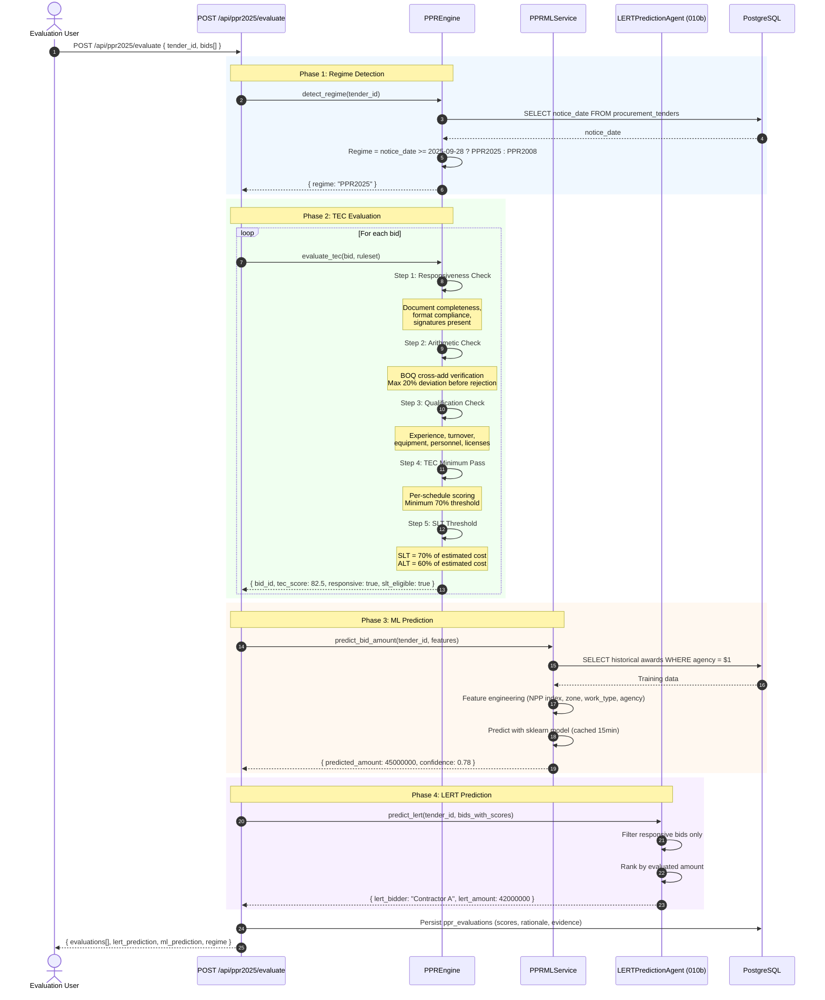

# SEQ-008: PPR 2025 Evaluation & TEC Scoring

## TEC Evaluation Rules

| Check | PPR 2025 Rule | Threshold |
|-------|--------------|-----------|
| Arithmetic Error | Max deviation before rejection | 20% |
| TEC Minimum Pass | Per-schedule score | 70% |
| SLT Threshold | Lowest 70% of estimated | 70% |
| ALT Threshold | Lowest 60% of estimated | 60% |
| Qualification | Experience + Turnover | Per TDS |
