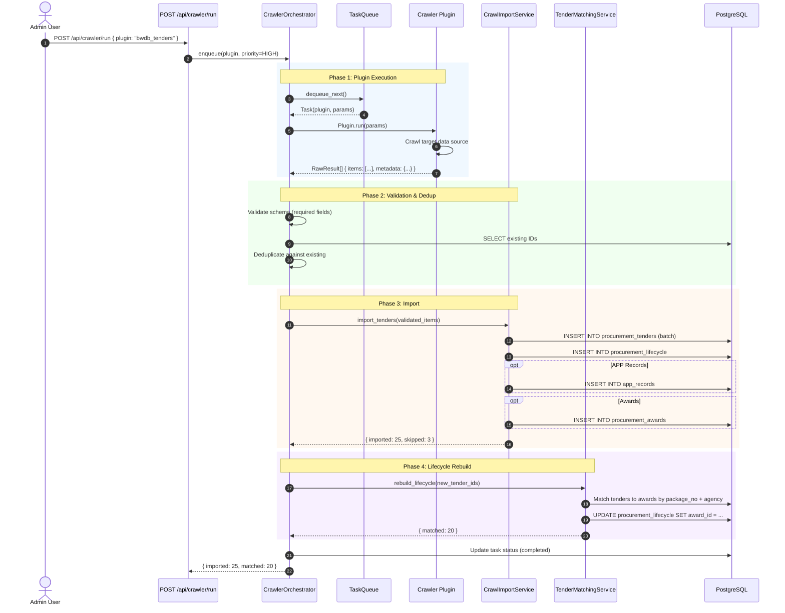

# SEQ-011: Crawler Orchestration & Data Import

## Plugin Types

| Plugin | Source | Frequency |
|--------|--------|-----------|
| bwdb_tenders | BWDB website | Daily |
| lged_tenders | LGED portal | Daily |
| pwd_tenders | PWD website | Daily |
| rhd_tenders | RHD website | Weekly |
| material_prices | BD seller sites | Weekly |

## Error Paths

1. **Plugin timeout** — Task marked FAILED after 5min, retry 2x
2. **Import conflict** — Duplicate tender_id → skip, log
3. **Schema validation** — Invalid item → reject, log to error queue
