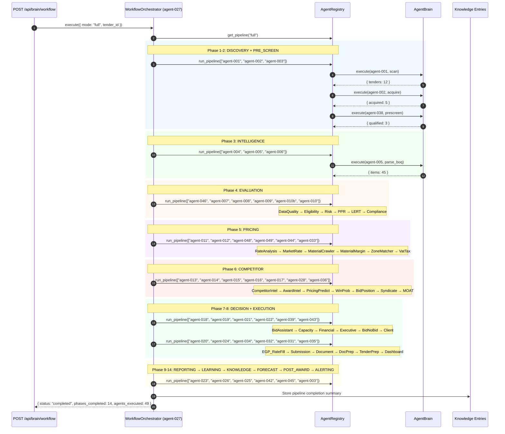

# SEQ-012: Multi-Agent Orchestrator Pipeline (14 Phases)

## Pipeline Phases

| Phase | Agents | Purpose |
|-------|--------|---------|
| 1. Discovery | 001, 002, 003 | Find + acquire tenders |
| 2. Pre-Screen | 038 | Narrow to qualified candidates |
| 3. Intelligence | 004, 005, 006 | Parse documents |
| 4. Evaluation | 046, 007, 008, 009, 010b, 010 | Compliance + risk |
| 5. Pricing | 011, 012, 048, 049, 044, 033 | Rate analysis |
| 6. Competitor | 013, 014, 015, 016, 017, 028, 036 | Competition intel |
| 7. Decision | 018, 019, 021, 022, 039, 043 | Bid/No-Bid |
| 8. Execution | 020, 024, 034, 032, 031, 035 | Tender prep |
| 9. Reporting | 023 | Report generation |
| 10. Learning | 026 | Outcome tracking |
| 11. Knowledge | 025 | Knowledge lake |
| 12. Forecast | 042 | APP forecasting |
| 13. Post-Award | 045 | Opening reports |
| 14. Alerting | 003 | Watchdog alerts |
