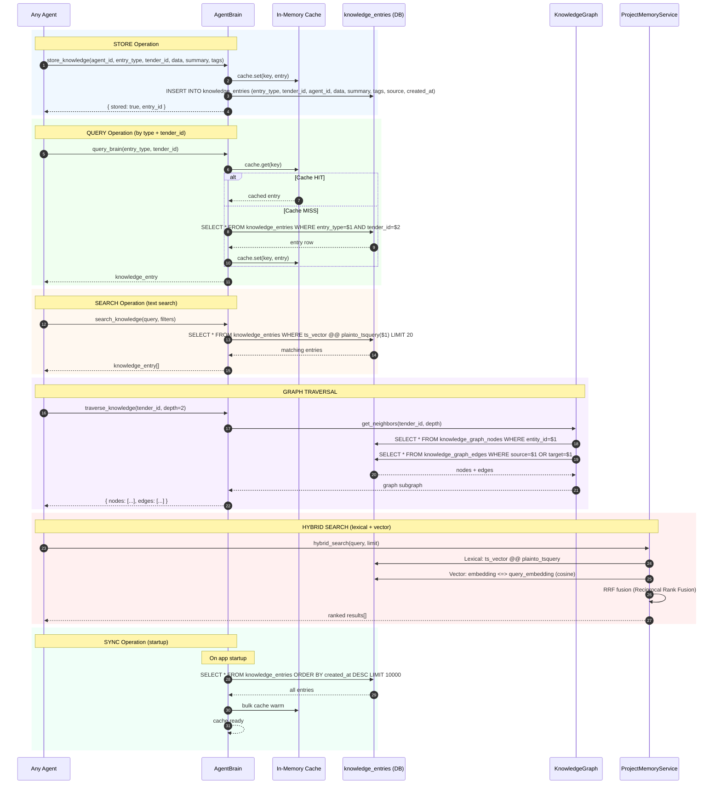

# SEQ-013: Knowledge Brain Query & Storage

## Knowledge Entry Types

| entry_type | Content | Stored By |
|------------|---------|-----------|
| `tender_document` | Full acquisition metadata | agent-002 |
| `boq_text` | Extracted BOQ text (50K chars) | agent-002 |
| `tds_text` | Extracted TDS text (50K chars) | agent-002 |
| `pipeline_result` | Pipeline completion summary | agent-027 |
| `bid_decision` | Bid/No-Bid rationale | agent-039 |
| `rate_analysis` | Item cost breakdowns | agent-011 |
| `competitor_profile` | Competitor intelligence | agent-013 |

## Cache Strategy

| Operation | Cache | TTL | Invalidation |
|-----------|-------|-----|-------------|
| Store | Write-through | Permanent | On store |
| Query by type+tender | Read-through | 5min | On store (same key) |
| Search | No cache | — | — |
| Graph | No cache | — | — |
| Sync | Bulk warm | Permanent | On startup |
