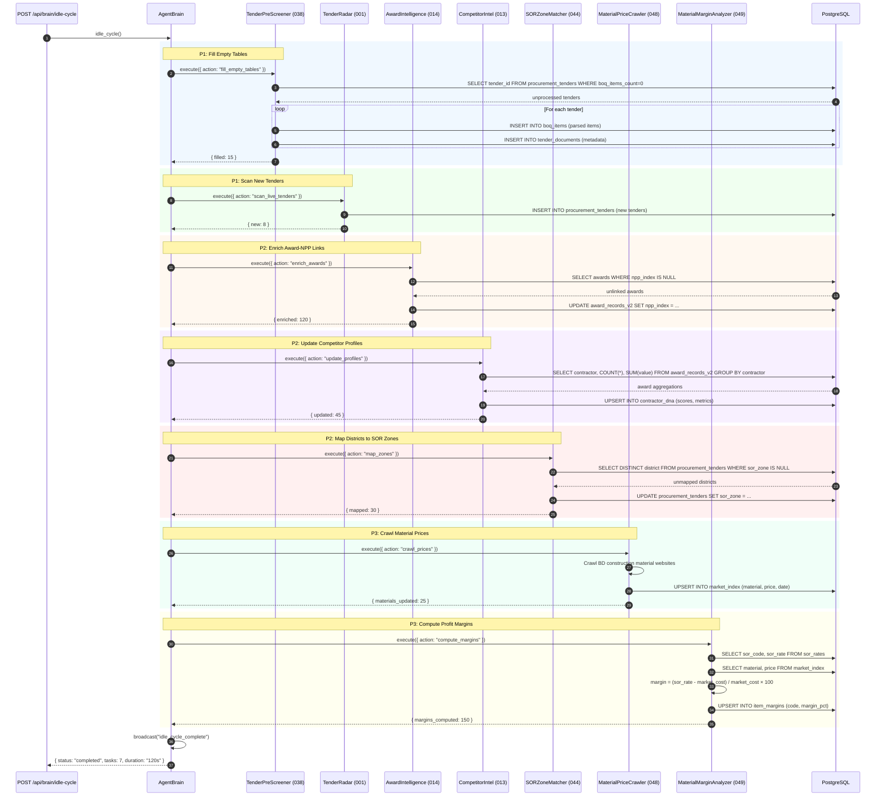

# SEQ-015: Idle-Time Intelligence Cycle

## Idle Cycle Priority Tiers

| Priority | Agents | Purpose | Frequency |
|----------|--------|---------|-----------|
| P1 | 038, 001 | Fill gaps + discover | Every idle cycle |
| P2 | 014, 013, 044 | Enrich existing data | Every idle cycle |
| P3 | 048, 049 | Predictive pre-computation | Every 2nd cycle |
| P4 | 025 | Knowledge lake backfill | Weekly |

## Timing

| Phase | Duration |
|-------|----------|
| P1: Fill + Scan | 30-60s |
| P2: Enrich | 20-40s |
| P3: Crawl + Compute | 40-80s |
| **Total** | **90-180s** |
